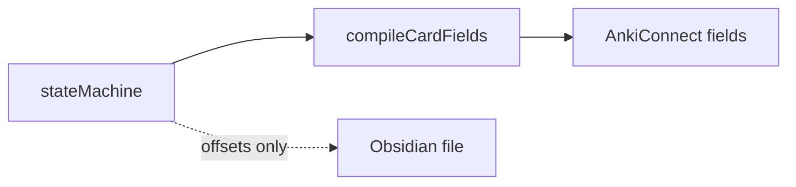
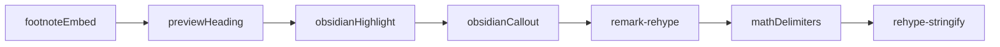

# Card Rendering Specification

How front and back **card fields** are compiled from mdast subtrees into HTML for Anki. For vault safety (no stringify back to disk), see [Engine-Architecture.md](Engine-Architecture.md#read-only-ast-and-vault-safety).

## Problem

The legacy `nodesToPreview` helper flattened all text nodes and collapsed whitespace. That destroyed paragraph breaks, emphasis, tables, and line breaks even when the AST already encoded them correctly.

Card rendering must preserve **block structure** and **inline markup** from the extracted `frontNodes` / `backNodes` arrays.

## Two pipelines

| Pipeline | Input | Output | Touches vault `.md`? |
|----------|-------|--------|----------------------|
| **Vault** | Full file `rawText` | AST for extraction + byte offsets | Only surgical `<!--anki-id-->` splice |
| **Anki card field** | `frontNodes` / `backNodes` per card | `frontHtml` / `backHtml` | No |



Implementation: [`src/ast/cardCompiler.ts`](../src/ast/cardCompiler.ts) (`compileCardFields` for footnote-aware cards; `compileCardField` for single-side compile)

## Block-level mapping

| mdast node | HTML (typical) |
|------------|----------------|
| `paragraph` | `<p>…</p>` |
| `heading` | `<h1>`–`<h6>` (from preview-heading transform only inside card compile) |
| `break` | `<br>` |
| `strong` / `emphasis` | `<strong>` / `<em>` |
| `delete` (GFM) | `<del>` |
| `list` / `listItem` | `<ul>` / `<ol>` + `<li>` |
| `table` | `<table>` |
| `thematicBreak` | `<hr>` |
| `code` (fenced) | `<pre><code>` |
| `inlineCode` | `<code>` |
| `blockquote` | `<blockquote>` (or callout `<div>` when `> [!type]`) |
| `inlineMath` / `math` | `\(...\)` / `\[...\]` in span/div (Anki MathJax renders) |
| `image` | `` |
| `link` | `<a href="…">` |
| `html` | passed through (e.g. `<!--anki-id-->` stripped before compile) |

## Paragraph and line-break rules

**Blank line(s) between blocks** → separate mdast block nodes → separate HTML blocks. Multiple blank lines in source collapse to one paragraph boundary (mdast normalization); one `<p>` gap is sufficient.

Example (front of a card):

```markdown
What is entropy in thermodynamics?

It measures how dispersed energy is in a closed system.
```

Compiles to two `<p>` elements, not one run-on sentence.

**Soft line break** — trailing backslash before newline, no blank line between:

```markdown
Line one\
Line two
```

Compiles to one `<p>` with `<br>` between lines.

## Preview headings (`: ##` convention)

Inside card **front** or **back** body, a line starting with `: ` followed by Markdown heading markers is a **preview heading** for Anki only:

```markdown
: ## Key formula

E = mc²
```

- At **parse time** in Obsidian: plain paragraph text (no TOC entry).
- At **compile time**: transformed to an `heading` node → `<h2>Key formula</h2>`.

Syntax: `: #{1,6} title text` (colon, space, hashes, space, title).

## Obsidian highlight

`==highlighted text==` → `<mark>highlighted text</mark>` via compile-time plugin. Not parsed as GFM; applied only during card compilation.

## Math (MathJax delimiters)

- **Parse time** ([`processor.ts`](../src/ast/processor.ts)): `remark-math` turns `$E=mc^2$` and `$$...$$` into `inlineMath` / `math` mdast nodes. Delimiters inside math are ignored by [`delimiterCheck.ts`](../src/parser/delimiterCheck.ts).
- **Compile time** ([`cardCompiler.ts`](../src/ast/cardCompiler.ts)): math nodes become lightweight HTML with LaTeX delimiters Anki MathJax already understands:
  - Inline: `<span class="math-inline">\(E=mc^2\)</span>`
  - Display: `<div class="math-display">\[...\]</div>`
- **No SVG pre-render** — Anki (and Obsidian) render math at display time, same as `$...$` in source. Keeps `frontHtml`/`backHtml` small and readable in dry-run JSON.

## Obsidian callouts

`> [!note]` blockquotes are compile-time transforms only (vault file unchanged):

```markdown
> [!warning] Custom title
> Body text here.
```

Compiles to:

```html
<div class="callout callout-warning">
  <p class="callout-title">Custom title</p>
  <p>Body text here.</p>
</div>
```

Plugin: [`remarkObsidianCallout.ts`](../src/ast/remarkObsidianCallout.ts). Collapsible `+`/`-` modifiers are not supported in V2.

## Footnotes (card-scoped embed)

GFM footnotes (`[^id]` / `[^id]: text`) use [`compileCardFields`](../src/ast/cardCompiler.ts) + [`remarkFootnoteEmbed.ts`](../src/ast/remarkFootnoteEmbed.ts):

1. Collect definitions from front and back subtrees.
2. Number references by first appearance across **both** sides.
3. Front: `<sup>n</sup>` only (no footer).
4. Back: body content, then `<hr>`, then ordered list of footnote definitions at the bottom.

Definitions are stripped from mid-body flow; they appear only in the back footer.

## Wikilinks in card bodies

After transclusion grafting, remaining `[[links]]` compile to `<a>` elements. Embeds should already be expanded to inline content before compile.

## Dry-run / AnkiConnect contract

`SyncAction` fields:

| Field | Content |
|-------|---------|
| `frontHtml` | Compiled HTML for front field |
| `backHtml` | Compiled HTML for back field |

Replaces legacy `frontPreview` / `backPreview` plain-text flattening.

## Compiler pipeline



## Non-goals

- `remark-stringify` or any Markdown rewrite of vault files
- Collapsible callout modifiers (`+`/`-`)

## Fixtures

| Fixture | Covers |
|---------|--------|
| [`card-rich-formatting.md`](../tests/fixtures/card-rich-formatting.md) | Paragraphs, soft break, emphasis, table, HR, highlight, preview heading, code |
| [`card-math.md`](../tests/fixtures/card-math.md) | Inline/display MathJax; `:::` inside math |
| [`card-callouts.md`](../tests/fixtures/card-callouts.md) | Obsidian callout blockquotes |
| [`card-footnotes.md`](../tests/fixtures/card-footnotes.md) | Shared numbering; back footer embed |
| [`multi-line-card-layout.md`](../tests/fixtures/multi-line-card-layout.md) | Multi-paragraph front/back with `:::` |
| [`card-feature-stress-test.md`](../tests/fixtures/card-feature-stress-test.md) | Full permutation matrix (14 cards); CI via `syncPipeline.stressTest.test.ts` |
| [`embed_me.md`](../tests/fixtures/embed_me.md) | Transclusion target for heading-section embed (`![[embed_me#This section is for embedding]]`) |

**Manual dry-run:** point `config.json` `vaultPath` at `tests/fixtures` (with `deckMappings` covering that folder), ensure `embed_me.md` sits beside `card-feature-stress-test.md`, then run `bun run sync -- --dry-run`.

## Extension points

Add remark/rehype plugins in the card compiler pipeline only. Each new syntax needs a fixture and tests in [`tests/ast/cardCompiler.test.ts`](../tests/ast/cardCompiler.test.ts).
