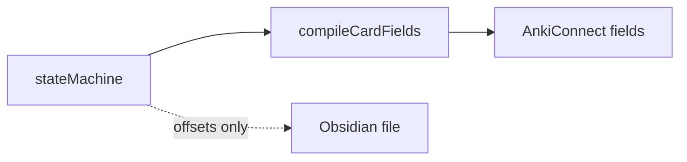
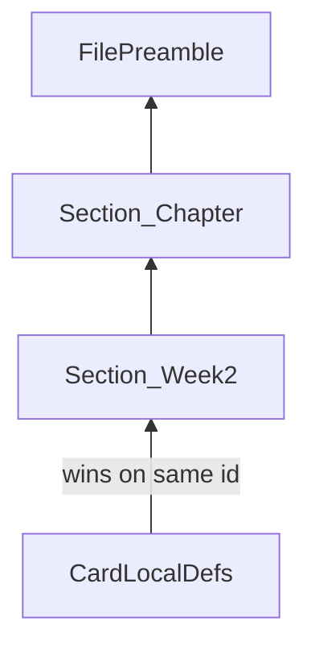
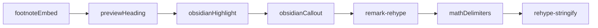

# Card Rendering Specification

How front and back **card fields** are compiled from mdast subtrees into HTML for Anki. For vault safety (no stringify back to disk), see [Engine-Architecture.md](Engine-Architecture.md#read-only-ast-and-vault-safety).

## Problem

The legacy `nodesToPreview` helper flattened all text nodes and collapsed whitespace. That destroyed paragraph breaks, emphasis, tables, and line breaks even when the AST already encoded them correctly.

Card rendering must preserve **block structure** and **inline markup** from the extracted `frontNodes` / `backNodes` arrays.

## Two pipelines

| Pipeline | Input | Output | Touches vault `.md`? |
|----------|-------|--------|----------------------|
| **Vault** | Full file `rawText` | AST for extraction + byte offsets | Only surgical `<!--anki-id-->` splice |
| **Anki card field** | `frontNodes` / `backNodes` per card | `frontHtml` / `backHtml` | No |



Implementation: [`src/ast/cardCompiler.ts`](../src/ast/cardCompiler.ts) (`compileCardFields` for footnote-aware cards; `compileCardField` for single-side compile)

## Block-level mapping

| mdast node | HTML (typical) |
|------------|----------------|
| `paragraph` | `<p>…</p>` |
| `heading` | `<h1>`–`<h6>` (from preview-heading transform only inside card compile) |
| `break` | `<br>` |
| `strong` / `emphasis` | `<strong>` / `<em>` |
| `delete` (GFM) | `<del>` |
| `list` / `listItem` | `<ul>` / `<ol>` + `<li>` |
| `table` | `<table>` |
| `thematicBreak` | `<hr>` |

### Trailing section separators (`---`)

In Obsidian, authors often place one or more `---` lines **after** a card’s answer and **before** the next H1–H4 heading to add visual separation. Those lines are still inside the card’s back buffer when the state machine finalizes at the next heading, which would compile to hanging `<hr>` elements at the bottom of the Anki field.

Before compile, [`stripTrailingSectionSeparators`](../src/parser/stripTrailingSectionSeparators.ts) removes **trailing** `thematicBreak` nodes from each card’s `frontNodes` / `backNodes`. Trailing `<!--anki-id-->` html nodes are preserved for vault binding.

| Kept | Removed |
|------|---------|
| `---` between paragraphs inside the answer | Trailing `---` immediately before the next section heading |
| Footnote footer `<hr>` added at compile time | One or more trailing `---` before `<!--anki-id-->` |

```markdown
#### Question

:::

Answer paragraph.

---        ← stripped (before # Next section)

# Next section
```

| `code` (fenced) | `<pre><code>` |
| `inlineCode` | `<code>` |
| `blockquote` | `<blockquote>` (or callout `<div>` when `> [!type]`) |
| `inlineMath` / `math` | `\(...\)` / `\[...\]` in span/div (Anki MathJax renders) |
| `image` | `` |
| `link` | `<a href="…">` |
| `html` | passed through (e.g. `<!--anki-id-->` stripped before compile) |

## Obsidian comments (`%% … %%`)

Obsidian inline and block comments are **authoring-only** — they stay in the vault but are removed before Anki HTML is compiled.

| Syntax | Vault | Anki field |
|--------|-------|------------|
| `%% inline note %%` | Visible in Obsidian (hidden in preview) | Stripped |
| `%%` … `%%` block (single or multiple paragraphs) | Visible in Obsidian | Stripped |
| `%%` inside fenced code | Literal text | Preserved |

Implementation: [`remarkObsidianComment.ts`](../src/ast/remarkObsidianComment.ts) in the card compile pipeline only. Card extraction and `<!--anki-id-->` injection use the original markdown; comments do not affect byte offsets.

```markdown
#### Question %% draft: tighten wording %%

Visible question text

:::

Answer paragraph

%%
TODO: add citation before sync
%%

Published answer only.
```

Compiles to Anki as if the `%%` regions were never written.

## Paragraph and line-break rules

**Blank line(s) between blocks** → separate mdast block nodes → separate HTML blocks. Multiple blank lines in source collapse to one paragraph boundary (mdast normalization); one `<p>` gap is sufficient.

Example (front of a card):

```markdown
What is entropy in thermodynamics?

It measures how dispersed energy is in a closed system.
```

Compiles to two `<p>` elements, not one run-on sentence.

**Soft line break** — trailing backslash before newline, no blank line between:

```markdown
Line one\
Line two
```

Compiles to one `<p>` with `<br>` between lines.

## Preview headings (`: ##` convention)

Inside card **front** or **back** body, a line starting with `: ` followed by Markdown heading markers is a **preview heading** for Anki only:

```markdown
: ## Key formula

E = mc²
```

- At **parse time** in Obsidian: plain paragraph text (no TOC entry).
- At **compile time**: transformed to an `heading` node → `<h2>Key formula</h2>`.

Syntax: `: #{1,6} title text` (colon, space, hashes, space, title).

## Obsidian highlight

`==highlighted text==` → `<mark>highlighted text</mark>` via compile-time plugin. Not parsed as GFM; applied only during card compilation.

## Math (MathJax delimiters)

- **Parse time** ([`processor.ts`](../src/ast/processor.ts)): `remark-math` turns `$E=mc^2$` and `$$...$$` into `inlineMath` / `math` mdast nodes. Delimiters inside math are ignored by [`delimiterCheck.ts`](../src/parser/delimiterCheck.ts).
- **Compile time** ([`cardCompiler.ts`](../src/ast/cardCompiler.ts)): math nodes become lightweight HTML with LaTeX delimiters Anki MathJax already understands:
  - Inline: `<span class="math-inline">\(E=mc^2\)</span>`
  - Display: `<p>\[...\]</p>` (plain paragraph, not a custom wrapper div — Anki MathJax ignores display math inside non-standard containers)
- **No SVG pre-render** — Anki (and Obsidian) render math at display time, same as `$...$` in source. Keeps `frontHtml`/`backHtml` small and readable in dry-run JSON.

## Obsidian callouts

`> [!note]` blockquotes are compile-time transforms only (vault file unchanged):

```markdown
> [!warning] Custom title
> Body text here.
```

Compiles to:

```html
<div class="callout callout-warning">
  <p class="callout-title">Custom title</p>
  <p>Body text here.</p>
</div>
```

Plugin: [`remarkObsidianCallout.ts`](../src/ast/remarkObsidianCallout.ts). Collapsible `+`/`-` modifiers are not supported in V2.

## Footnotes (hierarchical scoped embed)

GFM footnotes (`[^id]` / `[^id]: text`) use [`compileCardFields`](../src/ast/cardCompiler.ts), [`remarkFootnoteEmbed.ts`](../src/ast/remarkFootnoteEmbed.ts), and [`footnoteScopeIndex.ts`](../src/ast/footnoteScopeIndex.ts).

### Resolution order (inner wins on same id)

1. Definitions in the card’s own front/back
2. Non-card definitions in the innermost enclosing heading region (e.g. `### Week 2`)
3. Walk outward through ancestor heading regions (`##`, `#`, …)
4. Loose definitions before the first heading (file preamble)

Shared footnote blocks live in **non-card** regions: any heading depth other than `cardDeclarationHeadingLevel`, or loose `[^id]:` lines between cards. A `#### Footnotes` section cannot be used when cards are also declared at `####`.

### Numbering and footers

1. Merge inherited + card-local definitions (card overrides section/file on collision).
2. Number references by first appearance across **both** sides of the card.
3. **Per-side footers:** each field gets `<hr>` + `<ol>` only for ids cited on that side. If both sides cite the same note, both fields include its definition.

Definitions are stripped from mid-body flow; they appear only in footers.



## Images and media embeds

Obsidian image embeds are resolved **before** card compile and uploaded to the Anki collection media folder during live sync.

| Vault syntax | Engine behavior | Anki field |
|--------------|-----------------|------------|
| `![[photo.png]]` | Resolved as attachment (not note transclusion) → `image` mdast node | `` |
| `![[folder/photo.jpg]]` | Same; `src` is basename only (`photo.jpg`) | `` |
| `` | Standard markdown image; URL rewritten to basename | `` |

Filenames with spaces are rewritten for Anki (`Cell Diagram final.png` → `Cell_Diagram_final.png` in both `src` and the uploaded collection media name). Vault files keep their original names.

Supported extensions: `.png`, `.jpg`, `.jpeg`, `.gif`, `.webp` (see [`vaultIndex.ts`](../src/obsidian/vaultIndex.ts)). SVG, PDF, audio, and video are out of scope for V2.

Pipeline:

1. [`transclusionGraft.ts`](../src/ast/transclusionGraft.ts) — wiki image embeds short-circuit to `image` nodes when the file exists (note transclusion unchanged for `![[Note]]` / block refs).
2. [`mediaResolver.ts`](../src/ast/mediaResolver.ts) — rewrites any remaining wiki media to `image` nodes and queues upload plans.
3. [`cardCompiler.ts`](../src/ast/cardCompiler.ts) — `image` → `` with literal `src` (spaces preserved; no `%20` encoding).
4. [`mediaQueue.ts`](../src/anki/mediaQueue.ts) — live sync uploads files before card notes are sent.

Paragraph-only images (`` on its own line) are hoisted to root-level `image` nodes before compile so they render as `` rather than empty `<p>` elements.

Fixture assets for tests: `bun run setup:fixtures` (see [`scripts/download-fixture-assets.ts`](../scripts/download-fixture-assets.ts)). Committed images under `tests/fixtures/assets/` must be real files (not empty placeholders); tests refuse to upload media smaller than 1 KB. You can drop manual downloads in `assets/media/` or `assets/nested/` and re-run setup to copy them to canonical names (`sample.jpg`, `path.png`, etc.).

## Wikilinks in card bodies

After transclusion grafting, remaining `[[links]]` compile to `<a>` elements. Embeds should already be expanded to inline content before compile.

## Dry-run / AnkiConnect contract

`SyncAction` fields:

| Field | Content |
|-------|---------|
| `frontHtml` | Compiled HTML for front field |
| `backHtml` | Compiled HTML for back field |

Replaces legacy `frontPreview` / `backPreview` plain-text flattening.

## Compiler pipeline



## Non-goals

- `remark-stringify` or any Markdown rewrite of vault files
- Collapsible callout modifiers (`+`/`-`)

## Fixtures

| Fixture | Covers |
|---------|--------|
| [`card-rich-formatting.md`](../tests/fixtures/card-rich-formatting.md) | Paragraphs, soft break, emphasis, table, HR, highlight, preview heading, code |
| [`card-math.md`](../tests/fixtures/card-math.md) | Inline/display MathJax; `:::` inside math |
| [`card-callouts.md`](../tests/fixtures/card-callouts.md) | Obsidian callout blockquotes |
| [`card-footnotes.md`](../tests/fixtures/card-footnotes.md) | Card-local footnotes; per-side footers |
| [`card-footnotes-scoped.md`](../tests/fixtures/card-footnotes-scoped.md) | Section/chapter scoped shared footnotes |
| [`multi-line-card-layout.md`](../tests/fixtures/multi-line-card-layout.md) | Multi-paragraph front/back with `:::` |
| [`card-feature-stress-test.md`](../tests/fixtures/card-feature-stress-test.md) | Full permutation matrix (14 cards); CI via `syncPipeline.stressTest.test.ts` |
| [`embed_me.md`](../tests/fixtures/embed_me.md) | Transclusion target for heading-section embed (`![[embed_me#This section is for embedding]]`) |

**Manual dry-run:** point `config.json` `vaultPath` at `tests/fixtures` (with `scanFolders` covering that folder), ensure `embed_me.md` sits beside `card-feature-stress-test.md`, then run `bun run sync -- --dry-run`.

## Extension points

Add remark/rehype plugins in the card compiler pipeline only. Each new syntax needs a fixture and tests in [`tests/ast/cardCompiler.test.ts`](../tests/ast/cardCompiler.test.ts).
