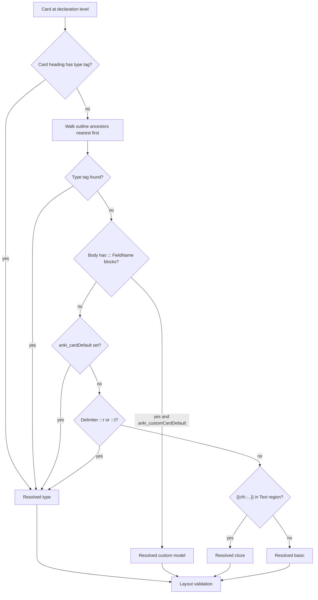

# Card Syntax Specification

**Status:** Pre-implementation contract (v1 grammar)  
**Supersedes:** design discussion in [Syntax decision conversation.md](Syntax%20decision%20conversation.md)  
**Stress-test fixture:** [card-syntax-stress-test.md](../../tests/fixtures/new%20format/card-syntax-stress-test.md)

This document defines how Obsidian markdown maps to Anki note types, fields, and sync behavior. Every rule has a stable **Rule ID** for tests and implementation.

---

## Section 0 — Scope and vocabulary

### Built-in card types (internal ids)

| Internal id | Anki model (configurable) | Primary fields |
|-------------|---------------------------|----------------|
| `basic` | Basic | Front, Back |
| `cloze` | Cloze | Text, Back Extra (optional) |
| `reversible` | Basic (and reversed card) | Front, Back |
| `typed` | Basic (type in the answer) | Front, Back (plain text) |

### Custom card type

A user-defined Anki note type identified by a **model id** (e.g. `Vocab`). The model id maps to the Anki model display name via naming convention, settings `anki_modelMap`, and AnkiConnect validation at sync.

### Card declaration level

Default: **H4** (`cardDeclarationHeadingLevel: 4`). A **card** starts at a heading of this depth. Headings **shallower** than this level (H1–H3 when card level is H4) are **organizational** and may declare section-wide card type.

### Reserved hashtag namespace

Any hashtag matching `#anki/` or `#anki_card_` is an **engine directive**. These are **never** synced to Anki as tags.

### Terminology

- **`cardType`** — built-in type (`basic`, `cloze`, `reversible`, `typed`)
- **`model`** — custom Anki note type
- Use **`#anki/cardType/*`** only; `#anki/noteType/*` is **invalid** (see **TAG-04**)

### Advanced settings (plugin)

These appear in the plugin **Advanced** section of settings. Config / CLI may expose the same keys.

| Setting key | Default | Effect |
|-------------|---------|--------|
| `inferClozeFromManualSyntaxOnBasic` | `false` | When `false` (default), `{{cN::...}}` in the Text region on a **basic-resolved** card is **literal text** (+ warn). When `true`, that syntax **reclassifies** the card as `cloze` and syncs as Cloze. See **BAS-04**, **RES-06**. |

### Text region

For built-in types using a front/back split, the **Text region** is all card body content **before** the first structural delimiter (`:::`, `:::r`, `:::t`, or `::: FieldName`). Content after that delimiter is the **Back region** (or field-specific regions for custom types).

---

## Section 1 — File gate and frontmatter

### FM-01 — Sync gate

**Rule:** A file is eligible for sync only when YAML frontmatter contains `AnkiSync` with a truthy value (`on`, `true`, `yes`, case-insensitive).

**Example — synced:**

```yaml
---
AnkiSync: on
---
```

**Example — skipped (entire file):**

```yaml
---
AnkiSync: off
---
```

---

### FM-02 — `anki_cardDefault`

**Rule:** Optional frontmatter key. When set, it establishes a **file-wide built-in type contract**, equivalent to placing `#anki/cardType/<value>` on the document root. Values: `basic`, `cloze`, `reversible`, `typed`.

**Example:**

```yaml
---
AnkiSync: on
anki_cardDefault: basic
---
```

**Effect:** Any card that does not resolve its type from a card heading, ancestor heading, delimiter, or cloze inference (see RES-06) uses `basic`. If the card body layout does not match the resolved type → **skip** (conflict).

---

### FM-03 — `anki_customCardDefault`

**Rule:** Optional frontmatter key. Names a **custom model id**. Applies **only** when a card body contains at least one `::: FieldName` block **and** no model was resolved from card/ancestor hashtags (steps 1–2 of resolution).

**Example:**

```yaml
---
AnkiSync: on
anki_cardDefault: basic
anki_customCardDefault: Vocab
---
```

**Effect:** A card with `::: Word` / `::: Definition` blocks and no `#anki/model/*` in the inheritance chain resolves to custom model `Vocab`. Setting both `anki_cardDefault` and `anki_customCardDefault` is **not** a file-level conflict; per-card layout determines which applies.

---

### FM-04 — File defaults vs ancestor headings

**Rule:** Ancestor heading type declarations (Section 4) **override** file frontmatter defaults. File defaults apply only when steps 1–3 of resolution find nothing.

**Example:**

```markdown
---
anki_cardDefault: basic
---

### Thermodynamics #anki/cardType/cloze

#### Entropy
{{energy dispersal}} increases in isolated systems.
```

**Outcome:** Card resolves to `cloze` from `###`, not `basic` from frontmatter.

---

## Section 2 — Card and section structure

### STR-01 — Card boundary

**Rule:** A card begins at the declaration-level heading and ends immediately before the next heading of the same or shallower depth, or at end of file.

**Example** (`cardDeclarationHeadingLevel: 4`):

```markdown
#### Card A
question
:::
answer

#### Card B
...
```

Two cards: `Card A` and `Card B`.

---

### STR-02 — Section type on organizational headings

**Rule:** Headings **shallower** than the card declaration level may carry `#anki/cardType/*` or `#anki/model/*`. All descendant cards inherit that type unless overridden.

**Example:**

```markdown
### Week 2 #anki/cardType/cloze

#### Card A
{{mitochondria}} is the powerhouse of the cell.

#### Card B
{{ATP}} is produced here.
```

Both cards resolve to `cloze` (inherited from `###`).

---

### STR-03 — No section type on H5+

**Rule:** Headings deeper than the card declaration level cannot declare section card type. H5+ content is prose or custom field bodies only.

**Example** (card level H4):

```markdown
#### Card title

##### Not a section type tag
::: Word
entropy
```

`#####` is not a valid section-type carrier.

---

### STR-04 — User hashtags vs engine directives

**Rule:** User hashtags on card or section headings are synced to Anki (normalized). Hashtags in the reserved namespace (`#anki/`, `#anki_card_`) are stripped and used only for type resolution.

**Example:**

```markdown
### Thermodynamics #biology #anki/cardType/cloze
```

- Anki tags include: `biology` (plus heading-path tags if enabled)
- Anki tags **exclude:** `anki/cardType/cloze`

---

### STR-05 — Binding UUID comment

**Rule:** Each synced card may contain an HTML comment `<!--anki-id: <uuid>-->` for vault↔Anki binding. Unchanged from current engine behavior.

**Example:**

```markdown
#### Card title
front
:::
back
<!--anki-id: c089c368-1a38-4b8c-82e6-14a5df8d1449-->
```

---

## Section 3 — Type declaration syntax (hashtags)

### Supported forms

**Preferred (document as default):**

- `#anki/cardType/basic`
- `#anki/cardType/cloze`
- `#anki/cardType/reversible`
- `#anki/cardType/typed`
- `#anki/model/<ModelId>`

**Legacy (equivalent semantics):**

- `#anki_card_<ModelId>`
- `#anki/CustomCards/<id>` (or any `#anki/...` path that is not `cardType/`)

Users may choose their preferred form; the engine accepts all of the above.

---

### TAG-01 — One built-in cardType per heading

**Rule:** At most one `#anki/cardType/*` tag per heading. Two built-in cardType tags → **error** (card not synced; error reported).

**Example — error:**

```markdown
#### Bad #anki/cardType/cloze #anki/cardType/basic
```

---

### TAG-02 — cardType and model are mutually exclusive

**Rule:** A single heading cannot carry both `#anki/cardType/*` and `#anki/model/*` (or legacy model tags). → **error**

**Example — error:**

```markdown
#### Bad #anki/cardType/cloze #anki/model/Vocab
```

---

### TAG-03 — Model id mapping

**Rule:** The model id suffix (e.g. `My_Vocab`) maps to the Anki model name by:

1. Convention: underscores → spaces
2. Settings / config `anki_modelMap` overrides
3. AnkiConnect validation at sync (`modelNames`); clear error if not found

**Example:**

```markdown
#### Word #anki/model/My_Vocab
```

Maps to Anki model `"My Vocab"` unless `anki_modelMap` says otherwise.

---

### TAG-04 — `#anki/noteType/*` is rejected

**Rule:** `#anki/noteType/*` is **not** a valid engine directive. Only `#anki/cardType/*` declares built-in types. Hashtags like `#anki/noteType/cloze` are ignored for type resolution (treated as ordinary user tags unless they match another reserved pattern).

**Example — invalid for type resolution:**

```markdown
### Section #anki/noteType/cloze
```

**Outcome:** Section does **not** inherit `cloze`. Use `#anki/cardType/cloze` instead.

**Example — correct:**

```markdown
### Section #anki/cardType/cloze
```

---

## Section 4 — Type resolution order

Resolution runs **per card** after extracting the card body from the outline tree.



---

### RES-01 — Card heading wins

**Rule:** Type tag on the card heading overrides all ancestor declarations.

**Example:**

```markdown
### Section #anki/cardType/cloze

#### Override #anki/cardType/basic
Front
:::
Back
```

**Outcome:** Resolves to `basic` (card heading wins).

---

### RES-02 — Outline tree parent chain

**Rule:** Ancestor type inheritance follows the **structural outline parent chain**, not “last seen heading while reading downward.”

**Example:**

```markdown
### Unit A #anki/cardType/cloze
#### Card 1
{{foo}}

## Unit B
#### Card 2
What is entropy?
:::
A measure of dispersal.
```

- **Card 1** → `cloze` (parent chain includes `### Unit A`)
- **Card 2** → `basic` (parent chain: `## Unit B` → `#`; never reaches `### Unit A`)

---

### RES-03 — Nearest ancestor wins

**Rule:** Walk from card heading upward (immediate parent section heading, then next, etc.). **Stop** at the first heading with a type tag. Do not continue to higher levels.

**Example:**

```markdown
## Chapter #anki/cardType/basic
### Section #anki/cardType/cloze
#### Card
{{hidden}}
```

**Outcome:** `cloze` from `###`, not `basic` from `##`.

---

### RES-04 — Custom default is layout-triggered

**Rule:** `anki_customCardDefault` applies only when the card body contains `::: FieldName` block(s) and steps 1–2 did not resolve a model.

**Example:**

```yaml
anki_customCardDefault: Vocab
```

```markdown
#### Term
::: Word
entropy
::: Definition
A measure of energy dispersal.
```

**Outcome:** Custom model `Vocab` (no hashtag required).

---

### RES-05 — Delimiter sets type when unresolved

**Rule:** If type is still unresolved after steps 1–4:

- `:::r` anywhere as structural split delimiter → `reversible`
- `:::t` anywhere as structural split delimiter → `typed`

If type **is already resolved** (e.g. inherited `cloze`) and delimiter is `:::r` or `:::t` → **error** (see conflict matrix).

**Example:**

```markdown
#### Card
Question
:::r
Answer
```

**Outcome:** `reversible` (no hashtag needed).

---

### RES-06 — Cloze inference from `{{cN::...}}` (unresolved type only)

**Rule:** Step 6 applies **only when type is still unresolved** after steps 1–5. If the Text region contains `{{cN::...}}` (manual Anki cloze form), resolve as `cloze`.

**Rule (basic already resolved):** If type is already `basic` from steps 1–4, step 6 does **not** run. See **BAS-04** for `{{cN::...}}` on basic-resolved cards.

**Example — infer cloze (no prior type):**

```markdown
#### Mixed file card
The {{c1::mitochondria}} produces ATP.
```

**Outcome:** `cloze` (inferred from `{{c1::...}}` in Text).

**Example — basic-resolved (file default):**

```markdown
---
anki_cardDefault: basic
---
#### Card
The {{c1::mitochondria}} is important.
:::
Organelle details.
```

**Outcome:** `basic`; `{{c1::mitochondria}}` is literal in Front (default). See **BAS-04**.

---

### RES-07 — Final fallback

**Rule:** If no type tag, no applicable default, no delimiter signal, and no cloze inference applies → `basic`.

**Example:**

```markdown
#### Plain card
What is H₂O?
:::
Water.
```

**Outcome:** `basic`.

---

### RES-08 — Model tags inherit on sections

**Rule:** `#anki/model/<ModelId>` (and legacy forms) on organizational headings inherit to descendant cards identically to `#anki/cardType/*`.

**Example:**

```markdown
### Vocabulary #anki/model/Vocab

#### Term 1
::: Word
entropy
::: Definition
Energy dispersal measure.
```

**Outcome:** Custom model `Vocab` for `Term 1`.

---

### RES-09 — Sync reporting

**Rule:** Sync and dry-run output should state resolved type and source when non-obvious.

**Example message:**

```text
Card "Entropy" → cloze (inherited from ### Thermodynamics)
```

---

## Section 5 — Delimiter grammar

### DEL-01 — Standard split `:::`

**Rule:** Line-start `:::` (optional leading whitespace) splits front/back for `basic`, and for `reversible` / `typed` when type comes from hashtag.

**Example:**

```markdown
#### Card
Front prose
:::
Back prose
```

---

### DEL-02 — Reversible split `:::r`

**Rule:** `:::r` at line start splits question/answer and declares `reversible` (equivalent to `#anki/cardType/reversible`).

**Example:**

```markdown
#### Card
Question prose
:::r
Answer prose
```

---

### DEL-03 — Typed split `:::t`

**Rule:** `:::t` at line start splits question/answer and declares `typed`.

**Example:**

```markdown
#### Card
Capital of France?
:::t
Paris
```

---

### DEL-04 — Custom field boundary `::: FieldName`

**Rule:** When custom model is resolved: line-start `:::`, then **exactly one space**, then field name (trimmed; case-insensitive match to Anki model fields). Content until next `::: FieldName` or next card heading belongs to that field.

**Example:**

```markdown
#### Term #anki/model/Vocab
::: Word
entropy
::: Definition
A measure of energy dispersal.
```

---

### DEL-05 — No spaced reserved delimiters

**Rule:** `::: r` and `::: t` (space after `:::`) are **not** reversible/typed delimiters.

**Example — invalid as reversible:**

```markdown
::: r
answer
```

Use `:::r` instead.

---

### DEL-06 — Field name `r` vs reserved `:::r`

**Rule:** Only the token `:::r` or `:::t` immediately after line-start `:::` (no space) is reserved. `::: r` parses as custom field name `r` (when custom model active).

**Example:**

```markdown
#### Custom #anki/model/Edge
::: r
content for field named "r"
```

---

### DEL-07 — Delimiters ignored in code and math

**Rule:** `:::`, `:::r`, `:::t`, and `::: Field` patterns inside `code`, `inlineCode`, and `math` nodes are not structural delimiters.

**Example:**

````markdown
#### Card
```python
print(":::")
```
:::
Real back
````

Only the final `:::` splits the card.

---

### DEL-08 — First structural split wins

**Rule:** For basic/reversible/typed, the **first** structural `:::`, `:::r`, or `:::t` in the card body defines the Text/Back boundary.

**Example:**

```markdown
#### Card
Front
:::
Back line 1
:::
This is still back content (not a third field).
```

---

## Section 6 — Built-in type: `basic`

### BAS-01 — Requires `:::`

**Rule:** Resolved `basic` cards **must** contain a structural `:::` delimiter. Missing → **skip**.

**Example — skip:**

```markdown
#### Incomplete
Only front prose, no delimiter.
```

**Skip message:** `Card "Incomplete": basic card missing ::: delimiter — skipped`

---

### BAS-02 — Front and Back fields

**Rule:** Text region → Anki `Front` (compiled HTML). Back region → Anki `Back` (compiled HTML).

**Example:**

```markdown
#### Card
**Bold** question
:::
*Italic* answer
```

---

### BAS-03 — Bare `{{word}}` on basic

**Rule:** Resolved `basic` + `{{word}}` without `cN` prefix → **warn**, treat as **literal text** in output; remain `basic`.

**Example:**

```markdown
#### CS note
The template uses {{username}} for logging.
:::
See documentation.
```

**Outcome:** sync as basic; warn about `{{username}}` not being cloze.

---

### BAS-04 — `{{cN::...}}` on basic-resolved card

**Rule:** When type is **basic-resolved** (from card tag, ancestor, or `anki_cardDefault`), `{{cN::...}}` in the Text region is **literal text** by default: compile to Front/Back HTML as-is; emit a **warn**. Card remains `basic`.

**Advanced override:** When plugin setting `inferClozeFromManualSyntaxOnBasic` is `true`, reclassify as `cloze` and apply cloze compile rules (including auto-number if applicable).

**Example (default setting):**

```markdown
#### Card
The {{c1::mitochondria}} is important.
:::
Organelle details.
```

**Outcome:** sync as `basic`; `{{c1::mitochondria}}` literal in Front; **warn**.

**Example (`inferClozeFromManualSyntaxOnBasic: true`):**

Same markdown → sync as `cloze`; `{{c1::mitochondria}}` is an active deletion in Text.

---

### BAS-05 — Cloze syntax only in Back region

**Rule:** `{{cN::...}}` appearing **only** after the first `:::` does **not** change type and is **not** scanned for cloze. Card remains `basic` (or whatever type was resolved).

**Example:**

```markdown
#### Card
Normal front question
:::
The {{c1::answer}} was hidden here but this is basic back.
```

**Outcome:** `basic`; back compiles with literal or HTML handling of `{{c1::answer}}` per compile rules.

---

### BAS-06 — Wrong layout for basic

**Rule:** Resolved `basic` + structural `:::r`, `:::t`, or `::: FieldName` → **error** / **skip** (layout conflict).

**Example — error:**

```markdown
#### Card
Question
:::r
Answer
```

When resolved type is `basic` (not `reversible`).

---

## Section 7 — Built-in type: `cloze`

### CLZ-01 — Requires `{{}}` in Text region

**Rule:** Resolved `cloze` requires at least one valid non-empty `{{}}` deletion in the **Text region**. Type declaration alone is insufficient. Missing → **skip**.

**Example — skip:**

```markdown
### Section #anki/cardType/cloze
#### Card
No deletions here, only prose.
```

---

### CLZ-02 — Optional Back Extra

**Rule:** A plain `:::` after the Text region maps remaining content to Anki `Back Extra`. **Not required** for cloze.

**Example:**

```markdown
#### Card #anki/cardType/cloze
The {{c1::mitochondria}} produces ATP.
:::
Extra reference material for this note.
```

---

### CLZ-03 — Manual cloze form

**Rule:** `{{cN::text}}` and `{{cN::text::hint}}` are always valid when type is `cloze` (or inferred). Numbers are preserved as authored.

**Example:**

```markdown
#### Card
{{c1::mitochondria}} and {{c2::ATP::energy molecule}}
```

---

### CLZ-04 — Shorthand `{{text}}` (explicit cloze type only)

**Rule:** `{{text}}` and `{{text::hint}}` (no `cN`) are valid **only** when resolved type is `cloze` (from tag, inheritance, or default). Auto-numbering applies (CLZ-05).

**Example:**

```markdown
### Section #anki/cardType/cloze
#### Card
The {{mitochondria}} is the {{powerhouse::organelle}} of the cell.
```

---

### CLZ-05 — Auto-numbering algorithm

**Rule:**

1. Scan Text region for `{{...}}` (respect DEL-07).
2. Parse manual: `{{cN::text}}` / `{{cN::text::hint}}` — keep `cN`.
3. Parse auto (cloze type only): `{{text}}` / `{{text::hint}}`.
4. Group auto entries by `text.trim().toLowerCase()`.
5. Walk document order; assign `c1`, `c2`, … to each new group; reuse number for same group.
6. Manual groups are never reassigned. Auto `{{foo}}` merges into manual `{{c1::foo}}` if same normalized text.
7. Emit canonical `{{cN::text}}` or `{{cN::text::hint}}` before compile/sync.

**Example:**

```markdown
{{Java}} ... {{java}} ... {{Python}}
```

→ `{{c1::Java}}` ... `{{c1::java}}` ... `{{c2::Python}}`

---

### CLZ-06 — Hints and grouping

**Rule:** Hints do not affect grouping key. Same normalized text → same `cN`. **First hint wins**; later differing hints → optional **warn** in dry-run.

**Example:**

```markdown
{{bank}} ... {{bank::river edge}}
```

→ both `c1`; hint from first (`bank` has no hint).

---

### CLZ-07 — Manual + auto merge

**Example:**

```markdown
{{c1::foo}} ... {{foo}}
```

→ both `c1`.

---

### CLZ-08 — Intentional duplicate manual groups

**Example:**

```markdown
{{c1::foo}} ... {{c2::foo}}
```

→ separate cloze cards `c1` and `c2` (same text, different instances).

---

### CLZ-09 — Empty deletion

**Rule:** `{{}}` or `{{c1::}}` with empty text → **skip**.

**Example — skip:**

```markdown
#### Card #anki/cardType/cloze
Nothing valid here {{}}.
```

---

### CLZ-10 — Delimiter conflict on cloze

**Rule:** Resolved `cloze` + `:::r` or `:::t` → **error**.

---

### CLZ-11 — Cloze syntax only in Back region

**Rule:** If resolved type is `cloze` but all `{{}}` are only after `:::`, Text region has no valid deletions → **skip**.

**Example — skip:**

```markdown
#### Card #anki/cardType/cloze
Prose with no deletions.
:::
{{c1::too late}}
```

---

### CLZ-12 — Cloze syntax on custom model

**Rule:** When resolved type is **custom** (not `cloze`), `{{...}}` in field bodies is **literal** unless the card also resolves to `cloze` (impossible per TAG-02). Custom vocab cards do not auto-cloze.

**Example:**

```markdown
#### Term #anki/model/Vocab
::: Word
{{not a cloze}}
```

---

## Section 8 — Built-in type: `reversible`

### REV-01 — Anki model mapping

**Rule:** Internal id `reversible` maps to configurable Anki model name (default: `Basic (and reversed card)`).

---

### REV-02 — Declaration equivalents

**Rule:** `#anki/cardType/reversible` and `:::r` are equivalent. Both may appear together (redundant, valid).

**Example:**

```markdown
#### Card #anki/cardType/reversible
Question
:::r
Answer
```

**Outcome:** sync as reversible.

---

### REV-03 — Requires split

**Rule:** Must have `:::` or `:::r`. Missing → **skip**.

---

### REV-04 — basic + `:::r`

**Rule:** Resolved `basic` + `:::r` → **error**.

---

### REV-05 — cloze + `:::r`

**Rule:** Resolved `cloze` + `:::r` → **error**.

---

## Section 9 — Built-in type: `typed`

### TYP-01 — Declaration equivalents

**Rule:** `#anki/cardType/typed` and `:::t` are equivalent (redundant combination allowed).

---

### TYP-02 — Requires split

**Rule:** Must have `:::` or `:::t`. Missing → **skip**.

---

### TYP-03 — Plain-text answer

**Rule:** Back region → strip HTML tags, decode entities, trim. Result is Anki `Back` for type-in-answer checking.

**Example:**

```markdown
#### Card
Capital of France?
:::t
**Paris**
```

**Outcome:** Back field value `Paris`.

---

### TYP-04 — Multi-line back

**Rule:** Use the **first non-empty line** of the Back region only: trim whitespace, strip HTML tags, decode entities. Ignore subsequent lines.

**Example:**

```markdown
:::t
Paris
Lyon
```

**Outcome:** Back field value `Paris`.

---

### TYP-05 — Multiple acceptable answers

**Deferred v2.** Out of scope for v1.

---

### TYP-06 — Case and diacritics

**Rule:** Engine passes answer string through unchanged after stripping. Case-folding and diacritics are Anki template / user setting concerns.

---

## Section 10 — Custom models

### CUS-01 — Requires field blocks

**Rule:** Resolved custom model requires ≥1 `::: FieldName` block matching a field on the Anki model. → otherwise **skip**.

---

### CUS-02 — Unknown field name

**Rule:** `::: Definiton` when model has `Definition` → **error** with available field list.

**Example error:**

```text
Card "Term": unknown field "Definiton"; model "Vocab" has: Word, Definition, Example
```

---

### CUS-03 — Orphan custom layout

**Rule:** `::: Field` blocks present, no model in inheritance chain, no `anki_customCardDefault` → **skip**.

---

### CUS-04 — Plain `:::` on custom

**Rule:** Resolved custom + only plain `:::` (no `::: Field`) → **skip** / layout conflict.

---

### CUS-05 — Reserved delimiters on custom

**Rule:** Resolved custom + `:::r` or `:::t` → **error**.

---

### CUS-06 — Field order independent

**Rule:** `::: Definition` before `::: Word` is valid; fields map by name.

---

### CUS-07 — Layout remapping

**Deferred.** Mapping basic `:::` layout → custom field names via settings is post-v1.

---

## Section 11 — Master conflict matrix

| ID | Signals | Resolved type | Layout | Outcome | Example |
|----|---------|---------------|--------|---------|---------|
| CX-01 | `#anki/cardType/cloze` + `#anki/cardType/basic` same heading | — | — | **error** | TAG-01 |
| CX-02 | `#anki/cardType/cloze` + `#anki/model/Vocab` same heading | — | — | **error** | TAG-02 |
| CX-03 | `### cloze` + `#### #anki/cardType/basic` | basic | `:::` | **sync** | RES-01 |
| CX-04 | `### cloze` + `####` no override | cloze | `{{text}}` | **sync** | STR-02 |
| CX-05 | `### cloze` + `####` no `{{}}` | cloze | prose only | **skip** | CLZ-01 |
| CX-06 | `anki_cardDefault: basic` + cloze body, no type tag | basic | `{{foo}}` no `:::` | **skip** | FM-02 |
| CX-07 | `anki_cardDefault: basic` + `{{word}}` only | basic | `:::` + bare `{{}}` | **sync** + **warn** | BAS-03 |
| CX-08 | resolved `basic` | basic | no `:::` | **skip** | BAS-01 |
| CX-09 | resolved `basic` | basic | `:::r` | **error** | BAS-06, REV-04 |
| CX-10 | resolved `basic` | basic | `::: Field` | **error** | BAS-06 |
| CX-11 | resolved `cloze` | cloze | `:::r` or `:::t` | **error** | CLZ-10 |
| CX-12 | resolved `cloze` | cloze | `{{}}` only after `:::` | **skip** | CLZ-11 |
| CX-13 | resolved `cloze` | cloze | valid Text `{{}}` | **sync** | CLZ-01 |
| CX-14 | resolved `reversible` | reversible | `:::` or `:::r` | **sync** | REV-02 |
| CX-15 | resolved `reversible` | reversible | no split | **skip** | REV-03 |
| CX-16 | `#anki/cardType/reversible` + `:::r` | reversible | split | **sync** (redundant) | REV-02 |
| CX-17 | `#anki/cardType/basic` + `:::r` | basic vs reversible signal | `:::r` | **error** | REV-04 |
| CX-18 | resolved `typed` | typed | `:::t` or `:::` | **sync** | TYP-01 |
| CX-19 | resolved `custom` | custom | `::: Field` × N | **sync** | CUS-01 |
| CX-20 | resolved `custom` | custom | plain `:::` only | **skip** | CUS-04 |
| CX-21 | resolved `custom` | custom | `:::r` | **error** | CUS-05 |
| CX-22 | `::: Field` only, no model, no `anki_customCardDefault` | — | custom layout | **skip** | CUS-03 |
| CX-23 | `### Unit A cloze` then `## Unit B` sibling | basic (no inherit) | `:::` | **sync** | RES-02 |
| CX-24 | `{{c1::x}}` only in Back | basic | `:::` | **sync** basic | BAS-05 |
| CX-25 | resolved `cloze` + `{{c1::}}` in Text + optional `:::` | cloze | valid | **sync** | CLZ-02 |
| CX-26 | two `#anki/cardType/*` on section | — | — | **error** | TAG-01 |
| CX-27 | resolved `basic` | basic | `{{c1::x}}` in Text, default setting | **sync** + **warn** (literal) | BAS-04 |
| CX-27a | resolved `basic`, `inferClozeFromManualSyntaxOnBasic: true` | cloze (reclassified) | `{{c1::x}}` in Text | **sync** | BAS-04 |
| CX-28 | `{{}}` empty | cloze | empty | **skip** | CLZ-09 |
| CX-29 | section `#biology` + `#anki/cardType/cloze` | cloze | valid | **sync**; tag `biology` only | STR-04 |
| CX-30 | inherited `cloze` + `:::r` | cloze vs reversible | `:::r` | **error** | RES-05, CLZ-10 |

---

## Section 12 — Sync outcomes

| Outcome | When |
|---------|------|
| **sync** | Resolved type matches body layout; all validations pass |
| **skip** | Missing required delimiter or `{{}}`; orphan custom layout; empty cloze; model not found |
| **error** | Conflicting type signals on same card (tag vs delimiter vs layout) |
| **warn** | Bare `{{word}}` on basic; `{{cN::...}}` literal on basic (default); hint mismatch; informational inheritance |

### Canonical skip messages (examples)

```text
Card "<title>": basic card missing ::: delimiter — skipped
Card "<title>": cloze card has no {{}} deletions in Text region — skipped
Card "<title>": cloze deletions only in Back region — skipped
Card "<title>": custom field layout but no model resolved — skipped
Card "<title>": layout conflicts with resolved type "<type>" — skipped
Card "<title>": empty cloze deletion — skipped
```

### Canonical error messages (examples)

```text
Card "<title>": conflicting cardType tags on heading — error
Card "<title>": cardType and model tags on same heading — error
Card "<title>": :::r conflicts with resolved type "basic" — error
Card "<title>": :::t conflicts with resolved type "cloze" — error
```

### Canonical warn messages (examples)

```text
Card "<title>": {{word}} treated as literal on basic card — warning
Card "<title>": {{cN::...}} treated as literal on basic card (enable inferClozeFromManualSyntaxOnBasic to sync as cloze) — warning
Card "<title>": auto-numbered cloze hint mismatch for "<text>"; using first hint — warning
Card "<title>": resolved cloze (inherited from ### <section>) — info
```

---

## Section 13 — Deferred / out of scope v1

- **CUS-07:** Settings remapping basic `:::` / `:::r` layout → custom model field names
- **TYP-05:** Multiple acceptable typed answers (`Paris|Lyon`)
- Per-card YAML type blocks

---

## Section 14 — Locked design decisions (v1)

| ID | Decision |
|----|----------|
| **BAS-04 / RES-06 / CX-27** | `{{cN::...}}` on **basic-resolved** cards → **literal + warn** by default; plugin Advanced setting `inferClozeFromManualSyntaxOnBasic` opts into cloze reclassification |
| **TAG-04** | `#anki/noteType/*` **rejected**; use `#anki/cardType/*` only |
| **TYP-04** | Typed-answer back → **first non-empty line** after strip/trim/decode |

---

## Appendix A — Quick reference card

```markdown
---
AnkiSync: on
anki_cardDefault: basic
anki_customCardDefault: Vocab
---

### Section #anki/cardType/cloze

#### Cloze inherited
The {{mitochondria}} produces {{ATP}}.

#### Basic override #anki/cardType/basic
Question?
:::
Answer.

#### Reversible
Question
:::r
Answer

#### Typed
Question?
:::t
exact answer

#### Custom #anki/model/Vocab
::: Word
entropy
::: Definition
Energy dispersal measure.
```

---

## Appendix B — Rule ID index

| Section | Rule IDs |
|---------|----------|
| Frontmatter | FM-01 … FM-04 |
| Structure | STR-01 … STR-05 |
| Hashtags | TAG-01 … TAG-04 |
| Resolution | RES-01 … RES-09 |
| Delimiters | DEL-01 … DEL-08 |
| Basic | BAS-01 … BAS-06 |
| Cloze | CLZ-01 … CLZ-12 |
| Reversible | REV-01 … REV-05 |
| Typed | TYP-01 … TYP-06 |
| Custom | CUS-01 … CUS-07 |
| Conflicts | CX-01 … CX-30, CX-27a |
