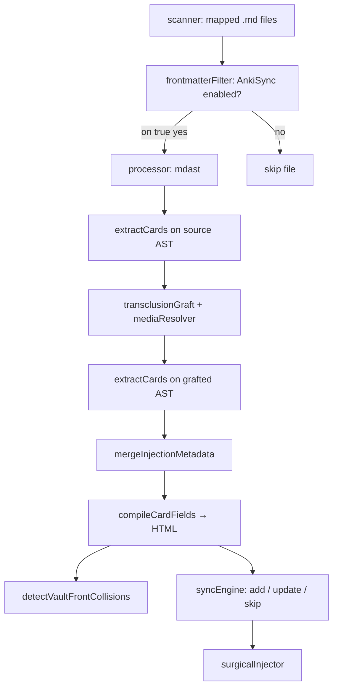
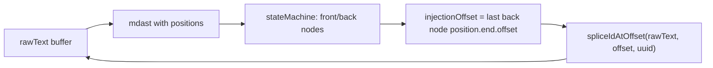

# Engine Architecture

Authoritative reference for **engine-specific** behavior (not Obsidian-native). For wikilink/embed/block resolution rules, see [Obsidian-Parity.md](Obsidian-Parity.md).

**Card type grammar (v1, pre-implementation):** [DECIDING/Card-Syntax-Spec.md](DECIDING/Card-Syntax-Spec.md) — stress-test fixture: [`tests/fixtures/new format/card-syntax-stress-test.md`](../tests/fixtures/new%20format/card-syntax-stress-test.md).

## Pipeline overview



Implemented in [`src/syncPipeline.ts`](../src/syncPipeline.ts):

1. **Scan** — `fast-glob` over vault folders listed in `scanFolders`
2. **Gate** — skip files unless `AnkiSync` is enabled (see below)
3. **Parse** — full raw file → mdast via `remark-gfm`, `remark-math`, and wiki-link plugins (frontmatter remains in tree; extractor uses `bodyStartOffset`)
4. **Extract (source)** — card boundaries and **injection offsets** from the **pre-graft** AST (byte positions in the vault file)
5. **Graft** — resolve `![[embeds]]` via vault index and block IDs; replace embed nodes with cloned subtrees from target files
6. **Media** — resolve attachment paths; queue dry-run uploads
7. **Extract (grafted)** — re-run state machine on grafted AST for **compile** buffers (transcluded content in front/back HTML)
8. **Merge** — `mergeInjectionMetadata` copies `ankiId` and `injectionOffset` from source cards onto grafted cards by index
9. **Compile** — `compileCardFields` → `frontHtml` / `backHtml` (GFM, MathJax, highlights, preview headings, callouts, footnote embed); see [Card-Rendering.md](Card-Rendering.md)
10. **Duplicate scan** — after all files are compiled, group by `deck + frontHtml`; emit `duplicate_warning` for collisions (see [Anki-Integration.md](Anki-Integration.md#duplicate-detection))
11. **Anki sync** — batched live path: `invokeMulti` prefetch, `addNotes` chunks, parallel updates; see [Sync-Performance-Roadmap.md](Sync-Performance-Roadmap.md#live-sync-flow-per-file) and [Anki-Integration.md](Anki-Integration.md#card-sync-performance)
12. **Inject** — plan or write `<!--anki-id: uuid-->` at pre-graft byte offsets (live sync after successful card sync)

## Read-only AST and vault safety

The AST is **not** an HTML converter and **not** a Markdown serializer for your vault. It is a **context map**: a tree of typed nodes (`heading`, `paragraph`, `code`, …) with parent-child relationships and **byte offsets** into the original file.

Regex treats the file as one flat string. An AST knows that `###` inside a fenced code block is a `code` node, not a card boundary. The state machine walks **structural** nodes only; [`delimiterCheck.ts`](../src/parser/delimiterCheck.ts) ignores delimiters inside `code`, `inlineCode`, and `math`.

### What we never do to Obsidian files

| Operation | Vault `.md` | Anki note (future) |
|-----------|-------------|-------------------|
| Parse with `remark-parse` | Yes — read structure | Yes — read card content |
| Modify AST in memory (graft, extract) | Yes — analysis only | Yes |
| **`remark-stringify` back to Markdown** | **Never** | N/A |
| Raw string splice at `position.end.offset` | **Yes** — inject `<!--anki-id: uuid-->` | N/A |
| `remark-rehype` + `rehype-stringify` → HTML | **Never** | **Yes** — AnkiConnect payload |

`remark-stringify` rewrites lists, spacing, and punctuation to its own style guide. Piping a modified AST through it would corrupt personal formatting across the vault. We avoid that entirely for file write-back.

### Surgical injection flow



1. Keep the **original** `rawText` in memory (or on disk).
2. Build the AST to locate card boundaries and the **end of the back** content.
3. Read `position.end.offset` from the last back node ([`stateMachine.ts`](../src/parser/stateMachine.ts)).
4. **Splice** the HTML comment into `rawText` at that index ([`surgicalInjector.ts`](../src/io/surgicalInjector.ts)) — no AST serialization.

Dry-run reports `wouldInjectId` without writing. Live sync will call `injectIdIntoFile` under a per-file mutex.

### Transclusion and injection offsets

Grafted nodes carry **byte positions from the embedded file**, not the host note. If injection offsets were taken from the post-graft AST, IDs could land inside unrelated regions of the host file (e.g. an HTML checklist comment at the top of a stress-test fixture instead of after `![[embed_me#…]]`).

**Rule:** injection offsets always come from the **source** (pre-graft) extraction. Grafted extraction is used only for HTML compilation.

[`mergeInjectionMetadata`](../src/io/surgicalInjector.ts) pairs cards by index after grafting and copies `ankiId` + `injectionOffset` from source onto grafted cards.

[`batchInjectIdsIntoFile`](../src/io/surgicalInjector.ts) refuses to splice inside an existing `<!-- … -->` HTML comment (`isOffsetInsideHtmlComment`), as a second guard rail.

Regression: [`tests/syncPipeline.injectionOffset.test.ts`](../tests/syncPipeline.injectionOffset.test.ts), fixture [`card-feature-stress-test.md`](../tests/fixtures/card-feature-stress-test.md) (transclusion on back).

### Minimal example

Source note:

```markdown
#### Vector

What is a vector?

:::

A quantity with magnitude and direction.

#### Next topic
```

The AST sees two H4 headings and knows where the first card’s back ends. Injection lands **after** “direction.” and **before** `#### Next topic`:

```markdown
…direction.

<!--anki-id: 550e8400-e29b-41d4-a716-446655440000-->

#### Next topic
```

Everything else — blank lines, list markers, `*` vs `-`, callouts — stays exactly as authored.

Regression fixtures: [`missing-id-injection.md`](../tests/fixtures/missing-id-injection.md), [`injection-required-no-ids.md`](../tests/fixtures/injection-required-no-ids.md).

Further detail on failure modes and mutex locking: [Starter Arch DR.md](Starter%20Arch%20DR.md) (surgical injection and Bottleneck 3).

## Per-file sync transaction

For each sync-eligible file ([`syncPipeline.ts`](../src/syncPipeline.ts)):

1. **Media upload** — `storeMediaFile` with concurrency 3: local `path` first, base64 `data` fallback, `url` for external `` images. If upload fails, no cards in that file are synced or injected.
2. **Per-card Anki sync** — batched when live: one `multi` `findNotes` prefetch per file, one `notesInfo` for all existing IDs, `addNotes` chunks for new cards, parallel updates (`pLimit(10)`). Duplicate recovery uses targeted `deck + front` search ([`frontSearch.ts`](../src/anki/frontSearch.ts)). One card’s failure does not abort siblings. See [Sync-Performance-Roadmap.md](Sync-Performance-Roadmap.md).
3. **Batch ID injection** — successful cards without an `anki-id` receive `<!--anki-id-->` in **reverse offset order** so earlier splices do not shift later offsets.

Partial success is intentional: a file with three new cards where one hits a non-recoverable error still injects IDs for the two that succeeded.

## Duplicate detection (vault-wide)

After compiling all cards in the run, the pipeline groups by **target deck + `frontHtml`**. Groups with more than one source card produce a `duplicate_warning` on stderr (dry-run and live). If backs differ within a group, the kind is `back_mismatch` — treated as an authoring error, not auto-merged.

Anki-level duplicate recovery (when `addNote` / `addNotes` is rejected) is separate; it emits `anki_duplicate_recovered`. See [Anki-Integration.md](Anki-Integration.md#duplicate-detection).

## HTML sync normalization

Field diffing and Anki writes normalize line endings inside `<pre><code>` blocks only ([`htmlNormalize.ts`](../src/anki/htmlNormalize.ts)). This prevents false `update` actions when Windows CRLF in source fenced code differs from LF stored in Anki.

## Sync gate: `AnkiSync` frontmatter

Files without YAML front matter, or without an `AnkiSync` key, are **ignored entirely**.

| `AnkiSync` value (case-insensitive) | Behavior |
|-------------------------------------|----------|
| `on`, `true`, `yes` | File is synced |
| `off`, `false`, `no` | File is skipped |
| Key absent | File is skipped |
| Any other value | File is skipped |

Key lookup is case-insensitive (`ankisync` matches `AnkiSync`). Quoted YAML values are supported.

**Removed:** `type: flashcard` and `status: active` are no longer used.

### Example card file

```yaml
---
AnkiSync: on
cardDeclarationHeadingLevel: 4
delimiter: ":::"
includeParentHeadersAsTags: true
target_anki_deck: "My Custom Deck"
file_anki_tags: exam-prep, biology
---
```

Disable sync without removing the key:

```yaml
---
AnkiSync: off
---
```

## Configuration (`config.json`)

Validated by Zod in [`src/config/configParser.ts`](../src/config/configParser.ts). See [`config.json.example`](../config.json.example).

| Field | Default | Purpose |
|-------|---------|---------|
| `vaultPath` | (required) | Absolute path to Obsidian vault |
| `delimiter` | `:::` | Front/back split token |
| `scanFolders` | (required) | Vault subfolders to glob for `.md` files |
| `defaultAnkiDeck` | `Synced from Obsidian` | Default Anki deck for synced cards |
| `defaultEngineTag` | `Obsidian-Anki-AST` | Tag applied to every synced note |
| `ankiConnectUrl` | `http://127.0.0.1:8765` | AnkiConnect endpoint |
| `linkFormat` | `shortest` | Link path style: `shortest`, `relative`, `absolute` |
| `attachmentFolder` | optional | Obsidian attachment folder name |
| `defaultCardDeclarationHeadingLevel` | `4` | H-level that starts a card (1–6) |
| `includeParentHeadersAsTags` | `true` | Join H1..H(n-1) into Anki tag path |

```json
{
  "vaultPath": "/path/to/your/ObsidianVault",
  "delimiter": ":::",
  "scanFolders": ["01 - Computer Science", "Notes"],
  "defaultAnkiDeck": "Synced from Obsidian",
  "defaultEngineTag": "Obsidian-Anki-AST",
  "ankiConnectUrl": "http://127.0.0.1:8765",
  "linkFormat": "shortest",
  "attachmentFolder": "attachments",
  "defaultCardDeclarationHeadingLevel": 4,
  "includeParentHeadersAsTags": true
}
```

## Per-file frontmatter overrides

Resolved in [`src/io/frontmatterFilter.ts`](../src/io/frontmatterFilter.ts). Config provides defaults; frontmatter wins when set.

| Key | Overrides |
|-----|-----------|
| `AnkiSync` | Sync on/off (required to sync) |
| `cardDeclarationHeadingLevel` | `defaultCardDeclarationHeadingLevel` |
| `delimiter` | `delimiter` in config |
| `includeParentHeadersAsTags` | `includeParentHeadersAsTags` in config |
| `target_anki_deck` | `defaultAnkiDeck` in config |
| `file_anki_tags` | Extra Anki tags (comma-separated) after engine tag |

Boolean frontmatter values accept `on`/`off`, `true`/`false`, `yes`/`no` (case-insensitive).

## Card layout modes

### Declaration mode (default)

When `cardDeclarationHeadingLevel` is set (default **H4** from config):

- Headings **below** the declaration level (H1–H3) provide **tag context**
- Headings **at** the declaration level start a new card
- The declaration heading may be the front, or prose before `:::` may form a separate front
- Tag separator is `::` (Anki hierarchy), distinct from the card delimiter `:::`

With `includeParentHeadersAsTags: true`:

```text
# CS101
### Week 2
#### Entropy
...
:::
...
→ tag: CS101::Week 2::Entropy
```

With `includeParentHeadersAsTags: false`:

```text
→ tag: Entropy
```

Canonical fixture: [`tests/fixtures/multi-line-card-layout.md`](../tests/fixtures/multi-line-card-layout.md)

### Legacy mode

When `cardDeclarationHeadingLevel` is **not** applied (no config default path in pipeline always sets it from config — legacy applies only when extraction is called without declaration level, e.g. some unit tests):

- `###` (or any heading) starts a card
- Tag = heading text only (no parent path)

## Delimiter conventions

Default delimiter: **`:::`**

- **Standalone line** — paragraph containing only `:::` splits front/back
- **Inline** — `Front ::: Back` in one paragraph
- **Code safety** — [`delimiterCheck.ts`](../src/parser/delimiterCheck.ts) ignores `code`, `inlineCode`, and `math` ancestors
- **Override** — set `"delimiter": "?"` in config or frontmatter; `?` has extra rules to avoid ternary false positives

| Fixture | Delimiter | Purpose |
|---------|-----------|---------|
| `edge-case-delimiters-triple-colon.md` | `:::` | `::` in inline code must not split |
| `edge-case-delimiters-in-code.md` | `?` | `?` override / ternary regression |

## Source layout

```
src/
├── index.ts                 # CLI entry
├── syncPipeline.ts          # Orchestration
├── config/configParser.ts
├── io/
│   ├── scanner.ts
│   ├── reader.ts
│   ├── frontmatterFilter.ts
│   └── surgicalInjector.ts
├── ast/
│   ├── processor.ts
│   ├── obsidianLinks.ts
│   ├── transclusionGraft.ts
│   ├── mediaResolver.ts
│   └── blockIdTagging.ts
├── parser/
│   ├── stateMachine.ts
│   └── delimiterCheck.ts
├── obsidian/
│   ├── linkResolver.ts
│   └── vaultIndex.ts
├── anki/
│   ├── client.ts            # AnkiConnect HTTP (invoke limit, retry, addNotes, multi)
│   ├── syncEngine.ts        # Batched add/update/skip card sync
│   ├── deckEnsurer.ts       # Per-run deck name cache
│   ├── frontSearch.ts       # Targeted duplicate Front lookup queries
│   ├── duplicateDetect.ts   # Vault front collisions + warning payloads
│   ├── htmlNormalize.ts     # Code-block line ending normalization for Anki
│   ├── tagNormalize.ts      # Anki tag path normalization
│   ├── mediaQueue.ts        # Tiered media upload queue
│   └── mediaTransport.ts    # Remote URL / path transport helpers
└── utils/
    ├── hash.ts
    ├── mutexMap.ts
    └── textPreview.ts
```

## Fixture index

| Fixture | Tests |
|---------|-------|
| `card-feature-stress-test.md` | Full compile-feature stress + transclusion injection offsets |
| `card-rich-formatting.md` | Rich formatting; duplicate-front pair with stress test (intentional) |
| `multi-line-card-layout.md` | H4 declaration layout; heading-as-front duplicate pair |
| `injection-required-no-ids.md` | ID injection offsets |
| `stress-test-nested-complex.md` | Transclusion + code delimiter ignore |
| `complex-media-paths.md` | Media resolution |
| `malformed-boundary-headings.md` | Empty back, heading-as-front |
| `malformed-html-comments.md` | Broken `anki-id` comments |
| `ignore-invalid-no-sync-trigger.md` | No `AnkiSync` → file skipped |
| `obsidian-parity/*` | Link/embed/block parity |

Run tests: `bun test`
