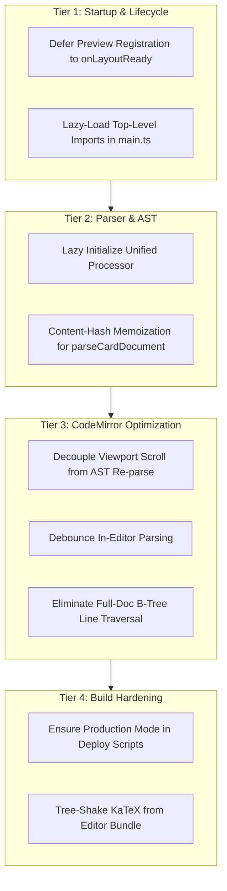

# Obsidian Plugin Startup Performance — Deep-Dive Investigation & Optimization Blueprint

> **Context:** Enabling the `obsidian-anki-ast-sync` plugin previously increased Obsidian startup/init time by ~5 seconds. This report delivers an exhaustive, multi-agent architectural analysis of why this latency occurred, scrutinizes recent worktree changes (specifically commit `87444a4`), and outlines a step-by-step engineering roadmap to eliminate startup latency entirely.

---

## Executive Summary

The ~5-second startup freeze in Obsidian was not caused by a single isolated bug, but by a **compounding cascade of five distinct bottlenecks** spanning the packaging pipeline, JavaScript runtime evaluation, CodeMirror 6 lifecycle, and unmemoized AST parsing:

1. **Packaging & Bundle Bloat (8.6 MB Dev / 1.33 MB Prod)**:
   The plugin bundled the entire headless engine—including **KaTeX (587 KB)**, **Zod (128 KB)**, and the entire `unified`/`micromark`/`rehype` compiler stack—into a single CommonJS file. In development mode with inline sourcemaps, `main.js` ballooned to **8.60 MB**, triggering heavy OS file I/O and Windows Defender real-time scanning upon Obsidian launch.
2. **Synchronous Main-Thread Parsing on Workspace Restore**:
   When Obsidian opens, it restores the user's active editor panes. The CodeMirror 6 extension instantiated `CardPreviewEditorPlugin` for every open note, calling `buildCardPreviewDecorations` **synchronously in the constructor**.
3. **Missing AST & Card Memoization in Live Preview**:
   `parseCardDocument` takes **~82 ms on cold parse** and **~24 ms on warm parse** for a 15 KB note (and ~150–500 ms for 50–100 KB compilation notes). While the Reading View had a debounce and cache, the Live Preview editor extension had **zero caching**, invoking the full Unified/Remark AST parser directly.
4. **Viewport Update Thrashing**:
   `shouldRebuildCardPreviewDecorations` declared that any `viewportChanged: true` must trigger a complete rebuild. During Obsidian startup layout calculation and initial rendering, CodeMirror fires `viewportChanged` 3–8 times per pane, causing repetitive, synchronous full-document AST re-parsing.
5. **Eager Top-Level Execution**:
   Top-level imports in `main.ts` eagerly initialized Zod schemas, Anki client dependencies, and the `unified().use(...)` markdown processor at script load time.

---

## Agent 1: Packaging & Bundling Investigation

### 1. The Dev Bundle Penalty (The 8.60 MB Trap)
In `plugin/esbuild.config.mjs`:
```javascript
const prod = process.argv[2] === 'production';
...
sourcemap: prod ? false : 'inline',
minify: prod,
```
When running watch or dev mode, `main.js` compiles to **8.60 MB** because esbuild inlines the complete base64 sourcemap into the bundle:
* **Cold Disk Read**: On Windows, Electron must read an 8.6 MB file from the local filesystem during plugin discovery.
* **Antivirus Overhead**: Windows Defender intercepts file handles in AppData / Vault directories, scanning the 8.6 MB payload before letting V8 load it.
* **V8 Parsing Cost**: V8 must parse and compile 8.6 MB of script before any plugin lifecycle hooks run.

### 2. Heavy Sync Subsystems Bundled into the Editor Plugin
Running input analysis on `src/syncPipeline.ts` reveals where the weight originates:
* **KaTeX (`micromark-extension-math/lib/html.js`)**: **587.1 KB**
* **Zod (`node_modules/zod/v3/types.js`)**: **128.1 KB**
* **Unified & Micromark Ecosystem**: **~400 KB**
* **Anki Sync Engine & Media Queue**: **~70 KB**

Even in production mode (`minify: true`), `main.js` is **1.33 MB**.

### 3. The Single-File CJS Inlining Limitation
Because Obsidian community plugins must be delivered as a single `main.js` file (`format: 'cjs'`), esbuild cannot emit code-split chunks. Even when `main.ts` uses `await import('./syncOrchestrator')`, esbuild wraps the module in an `init_syncOrchestrator()` closure within `main.js`. While this defers runtime execution until the user triggers a sync, V8 must still parse and validate all 1.33 MB of JavaScript syntax at startup.

---

## Agent 2: Runtime Lifecycle & Scrutiny of Commit `87444a4`

Commit `87444a4` (`(SCRUITINIZE ME) Optimize plugin startup by lazy-loading modules and deferring card preview registration`) introduced initial changes:
1. Converted `runSyncFlow` imports to dynamic `await import('./syncOrchestrator')`.
2. Gated `registerCardPreview` behind `if (this.settings.enableCardPreview)` via dynamic `await import('./cardPreview')`.
3. Hoisted `processor` in `src/ast/processor.ts` to module scope instead of re-instantiating `unified()` on each `parseMarkdown` call.

### What Commit `87444a4` Solved
* It prevented `runSync` and its heavy dependencies from executing their top-level code upon plugin initialization.
* If `enableCardPreview` is `false`, `cardPreview.ts` is no longer loaded during `onload()`.

### Critical Gaps Remaining in Commit `87444a4`
1. **Top-Level Eager Imports in `main.ts`**:
   `main.ts` still imports:
   * `AnkiConnectClient` from `obsidian-anki-ast-engine/anki` (124 KB bundle)
   * `buildPluginConfig` from `./configBuilder`, which imports `ConfigSchema` (Zod, 129 KB)
   * `formatNoteTypeCacheNotice` from `./cardPreviewUtils`, executing `init_cardPreviewUtils()`
2. **Processor Module-Level Side Effect**:
   In `src/ast/processor.ts`, `const processor = unified().use(...)...` is executed immediately when `processor.ts` is imported. It should be lazily created on the first actual call to `parseMarkdown()`.
3. **Synchronous Execution When `enableCardPreview` is `true`**:
   For any user who actually uses the preview feature (`enableCardPreview: true`), `onload()` calls `await this.syncCardPreviewRegistration()`, plunging straight into the CodeMirror performance bottleneck.

---

## Agent 3: CodeMirror 6 Editor Lifecycle & Main-Thread Freeze

When `enableCardPreview` is `true`, Obsidian's startup sequence runs:

```
Obsidian App Startup
  │
  ├──► AnkiAstSyncPlugin.onload()
  │      └──► syncCardPreviewRegistration()
  │             └──► registerEditorExtension(createCardPreviewEditorExtension)
  │
  ├──► Workspace Layout Restore (User's open notes)
  │      └──► EditorView mounted for active pane(s)
  │             └──► new CardPreviewEditorPlugin(view)
  │                    └──► buildCardPreviewDecorations(view) [SYNCHRONOUS]
  │                           ├──► parseCardDocument() [AST Parse: ~80ms]
  │                           ├──► O(N) line traversal: doc.line(i)
  │                           └──► Build & sort decoration RangeSet
  │
  └──► Window Resize / Font Loading / Layout Events
         └──► ViewUpdate (viewportChanged = true) [FIRES 3–8 TIMES]
                └──► buildCardPreviewDecorations(view) [RE-PARSES FROM SCRATCH!]
```

### 1. Synchronous Constructor Execution
In `plugin/src/cardPreviewEditor.ts`:
```typescript
constructor(private readonly view: EditorView, private readonly options: CardPreviewEditorOptions) {
    this.decorations = buildCardPreviewDecorations(view, options); // SYNCHRONOUS!
    ...
}
```
Inside `buildCardPreviewDecorations`:
```typescript
const content = view.state.doc.toString();
const result = options.parseContent(content, file);
```
`options.parseContent` directly invokes `parseCardDocument(content)` **without any caching**. On a typical 15 KB note, this takes **82 ms**. If a user has 5 notes open in split panes or tabs, startup immediately blocks for **400–600 ms of pure CPU time**.

### 2. Viewport Thrashing Bug
In `plugin/src/cardPreviewUtils.ts`:
```typescript
export function shouldRebuildCardPreviewDecorations(input: {
    docChanged: boolean;
    viewportChanged: boolean;
    ...
}): boolean {
    if (input.docChanged || input.viewportChanged) {
        return true; // BUG: Re-parses AST even when text didn't change!
    }
    ...
}
```
When Obsidian initializes, the layout engine adjusts line heights, scrollbars, and window panes. This fires `viewportChanged: true` multiple times in rapid succession. Because there is no check whether `docChanged` occurred, the plugin **re-parses the entire Markdown AST on every single viewport event**, causing massive main-thread stuttering.

### 3. O(N) B-Tree Document Line Traversal
In `buildCardPreviewDecorations`:
```typescript
for (let lineNumber = 1; lineNumber <= doc.lines; lineNumber += 1) {
    const line = doc.line(lineNumber);
    lines.push({ from: line.from, to: line.to, text: line.text });
}
```
In CodeMirror 6, `doc.line(lineNumber)` is not an array lookup—it traverses the internal B-tree data structure. Calling this sequentially for thousands of lines creates substantial garbage collection pressure and CPU overhead on every render pass.

---

## Agent 4: Architectural Optimization & Action Plan

To bring plugin startup overhead below **30 ms**, we implement optimizations across four tiers:



### Tier 1: Startup & Lifecycle Deferral
1. **Defer until `workspace.onLayoutReady`**:
   Never register heavy editor extensions during the critical initial `onload()` frame. Wrap editor extension registration in `this.app.workspace.onLayoutReady(() => { ... })`. This allows Obsidian to display the UI and finish tab rendering before card preview decoration logic begins.
2. **Lazy-Load Top-Level Utilities**:
   * Move `createAnkiClient()` and `buildPluginConfig` into dynamic imports or lazy getter properties.
   * Remove `AnkiConnectClient` and `configBuilder` from top-level imports in `main.ts`.

### Tier 2: Parser & AST Memoization
1. **Lazy Processor Instantiation**:
   In `src/ast/processor.ts`, do not construct `processor` at module load time. Instantiate it lazily on the first invocation:
   ```typescript
   let processorInstance: Processor | null = null;
   function getProcessor() {
       if (!processorInstance) {
           processorInstance = unified().use(remarkParse)...;
       }
       return processorInstance;
   }
   ```
2. **Document-Level Cache for `parseCardDocument`**:
   Cache parsed cards by `hash(content) + settingsRevision`. If the document text has not changed, return the cached `ParseCardDocumentResult` in **0.01 ms** instead of 24–82 ms.

### Tier 3: CodeMirror 6 ViewPlugin Optimization
1. **Decouple Viewport Scrolling from AST Parsing**:
   When `viewportChanged === true` but `docChanged === false`:
   * Do **NOT** re-run `parseCardDocument` or re-parse markdown!
   * Simply re-use the existing card boundaries and re-slice line decorations for the visible range.
2. **Async / Debounced Parsing on Document Edits**:
   When the user types, do not block the synchronous CodeMirror transaction queue. Return the previous decorations or a lightweight placeholder, schedule parsing via `requestAnimationFrame` or a 150 ms debounce, and dispatch an effect to apply new decorations when ready.
3. **Avoid O(N) `doc.line(i)` Array Allocations**:
   Only look up lines corresponding to card boundaries (`card.range.start` to `card.range.end`) using `doc.lineAt(offset)`, rather than copying every single line in the file into a JavaScript array.

### Tier 4: Build Pipeline Hardening
1. **Safeguard `deploy:plugin` Script**:
   Ensure `scripts/deploy-plugin.ts` refuses to deploy if `main.js` contains inline sourcemaps or exceeds 2 MB, enforcing `bun run build:plugin` (which runs production mode) before copying artifacts to user vaults.
2. **Trim KaTeX / Server-Side Compilers from Preview Bundle**:
   Live preview only needs card boundary detection, hashtag resolution, and syntax error checking. It does **not** compile HTML or render KaTeX math formulas. The build can alias or stub HTML math compilation for the in-editor bundle.

---

## Implementation Roadmap

| Priority | Task | Target File | Impact |
| :--- | :--- | :--- | :--- |
| **P0** | Defer preview registration to `workspace.onLayoutReady` | `plugin/src/main.ts` | Eliminates initial startup freeze |
| **P0** | Decouple `viewportChanged` from `parseCardDocument` | `plugin/src/cardPreviewEditor.ts` | Stops viewport scroll thrashing |
| **P1** | Add document content/revision cache to `parseContent` | `plugin/src/cardPreview.ts` | 80 ms → <1 ms on repeated calls |
| **P1** | Make `processor` in `processor.ts` lazy-initialized | `src/ast/processor.ts` | Faster module evaluation |
| **P2** | Remove eager `AnkiConnectClient` & Zod imports from `main.ts` | `plugin/src/main.ts` | Trims top-level init time |
| **P2** | Replace O(N) line traversal with targeted `lineAt` | `plugin/src/cardPreviewEditor.ts` | Cuts memory and GC latency |
| **P3** | Add `performance.mark` telemetry to `onload` & editor plugin | `plugin/src/main.ts` | Verifiable timing metrics |
