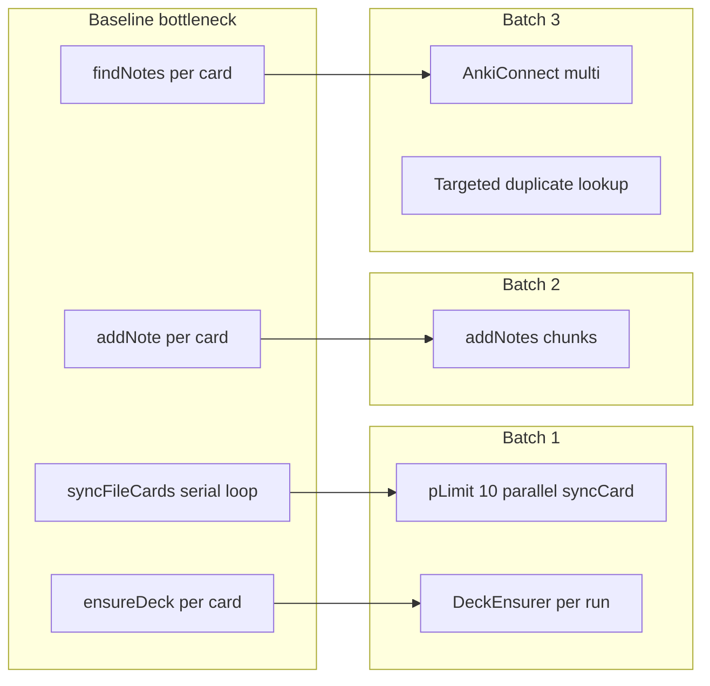

# Sync Performance Roadmap

This document tracks planned optimizations for **card sync** speed (AnkiConnect note add/update). Media upload performance is handled separately — see [Anki-Integration.md](Anki-Integration.md#per-file-transaction).

Related docs: [Engine-Architecture.md](Engine-Architecture.md), [Anki-Integration.md](Anki-Integration.md), [Starter Arch DR.md](Starter%20Arch%20DR.md) (original `pLimit(10)` design intent).

## Problem statement

After tiered media upload (`path` → `base64` → `url`), **card API chatter** becomes the dominant cost for large vault syncs.

Current behavior in [`syncEngine.ts`](../src/anki/syncEngine.ts) after all batches:

1. **`syncFileCards`** (live) prefetches obsidian-id lookups via **`invokeMulti`**, batch-adds new cards via **`addNotes`**, and parallelizes updates with **`pLimit(10)`**.
2. **`DeckEnsurer`** caches `deckNames()` for the whole sync run.
3. **Duplicate recovery** uses targeted `deck + front` search ([`frontSearch.ts`](../src/anki/frontSearch.ts)) with a per-run cache — not a full-deck scan.

## Live sync flow (per file)

When `runSync` runs in **live** mode, one [`SyncRunContext`](../src/anki/syncEngine.ts) is created for the whole vault run and passed to every `syncFileCards` call. For each sync-eligible file, after media upload succeeds:

| Step | API / module | Notes |
|------|----------------|-------|
| 1 | `DeckEnsurer.ensureDeck` | Unique target decks ensured once per run (cached `deckNames`, deduped `createDeck`) |
| 2 | `invokeMulti` → `findNotes` × N | One HTTP request: lookup every card’s `obsidian-id::<uuid>` tag |
| 3 | `notesInfo` | One request for all existing note IDs returned in step 2 |
| 4 | Parallel `updateNoteFields` / `updateNoteTags` | Up to 10 concurrent updates (`DEFAULT_SYNC_CONCURRENCY`) for cards that already exist in Anki |
| 5 | `addNotes` (chunks of 50) | New cards without a matching obsidian-id tag; `null` in result → duplicate recovery |
| 6 | Fallback `addNote` | If a whole `addNotes` chunk fails at HTTP level, retry cards individually |
| 7 | `recoverDuplicateNote` | Targeted `deck:"…" front:"…"` search via [`frontSearch.ts`](../src/anki/frontSearch.ts); results cached in `frontMatchCache` |

All AnkiConnect HTTP traffic goes through [`AnkiConnectClient.invoke`](../src/anki/client.ts):

- **Request cap:** `DEFAULT_INVOKE_CONCURRENCY` = **5** simultaneous requests (media + card sync share the pool).
- **Retry:** up to 3 attempts with exponential backoff on transient connection errors (e.g. `Unable to connect…` under load).

**Dry-run** skips steps 1–7 (no client); stdout still reports planned actions.

Constants are not configurable via `config.json` — see table in Batch 1 below.



## Batch 1 — Parallel sync + deck cache (done)

**Status:** Implemented.

**Goal:** ~5–10× faster multi-card files without changing sync semantics.

| Change | Module | Effect |
|--------|--------|--------|
| `pLimit(10)` on `syncFileCards` | [`syncEngine.ts`](../src/anki/syncEngine.ts) | Up to 10 cards sync concurrently per file |
| `SyncRunContext` per live run | [`syncEngine.ts`](../src/anki/syncEngine.ts), [`syncPipeline.ts`](../src/syncPipeline.ts) | Shared limiter + deck cache across all files in one vault run |
| `DeckEnsurer` | [`deckEnsurer.ts`](../src/anki/deckEnsurer.ts) | `deckNames()` once per run; deduplicated `createDeck` under concurrency |

**Preserved invariants:**

- Result order matches input order (pipeline indexes results by card position).
- Per-card errors do not abort siblings.
- Injection offsets collected only from successful cards.
- Dry-run unchanged (no Anki client).

**Concurrency:** fixed at **10** card workers (`DEFAULT_SYNC_CONCURRENCY`); HTTP calls are throttled to **5** concurrent requests per client (`DEFAULT_INVOKE_CONCURRENCY`) with automatic retry on transient AnkiConnect connection errors.

## Batch 2 — `addNotes` batching (done)

**Status:** Implemented.

**Goal:** Fewer HTTP round trips on first-time sync when many cards lack `<!--anki-id-->`.

| Step | Detail |
|------|--------|
| Client | `addNotes()` on [`client.ts`](../src/anki/client.ts) with same duplicate options as `addNote` |
| Batched path | `syncFileCards` with `SyncRunContext` chunks new cards (~50) via `addNotes` after prefetch |
| Fallback | Whole-batch failure → per-card `addNote`; `null` slot → `recoverDuplicateNote` |

**Caveat:** AnkiConnect's Python `addNotes` still loops internally; main win is Node ↔ Anki HTTP latency, not SQLite write parallelism.

## Batch 3 — HTTP batching + duplicate path (done)

**Status:** Implemented.

**Goal:** Faster updates and safe duplicate recovery on large decks.

| Step | Detail |
|------|--------|
| `invokeMulti()` | One `multi` request per file for all obsidian-id `findNotes` lookups |
| Batch `notesInfo` | Single call for all existing note IDs in the file |
| Targeted duplicate lookup | [`frontSearch.ts`](../src/anki/frontSearch.ts) — `deck:"…" front:"…"` instead of full-deck scan |
| Per-run cache | `SyncRunContext.frontMatchCache` deduplicates duplicate-recovery lookups |

## Non-goals and risks

| Risk | Mitigation |
|------|------------|
| Unlimited parallelism freezes Anki | Hard cap at 10 update workers; HTTP capped at 5 (`DEFAULT_INVOKE_CONCURRENCY`) |
| Transient connection errors under load | Automatic retry in `client.invoke` (3 attempts, backoff) |
| Race on `createDeck` for new deck | `DeckEnsurer` deduplicates in-flight creates per deck name |
| Wrong injection order | Results indexed by input card position before injection collection |
| `addNotes` batch hides per-note errors | Map `null` slots to individual recovery; never silent drop |

## Verification

```bash
bun test tests/anki/deckEnsurer.test.ts tests/anki/syncEngine.test.ts tests/anki/syncEngine.batch.test.ts tests/anki/client.batch.test.ts tests/anki/frontSearch.test.ts
bun test tests/syncPipeline.live.test.ts
bun run sync -- --dry-run   # no Anki required
bun run sync                # manual: multi-card fixture files should feel faster
```
