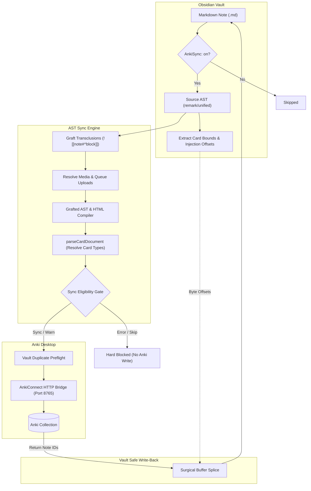

# Anki AST Sync 🧠⚡️

[](tests/)
[](LICENSE)
[](plugin/)
[](https://bun.sh)

A deterministic, AST-powered synchronization pipeline and Obsidian plugin bridging **Obsidian** and **Anki**.

Traditional flashcard sync tools rely on fragile Regular Expressions (Regex) that break when confronted with modern Markdown complexities like nested code blocks, escaped characters, LaTeX math formulas, Obsidian callouts, HTML tables, or block transclusions (`![[SourceNote#^block-id]]`). Worse, many tools re-serialize your entire Markdown file through formatters, destroying your custom formatting, spacing, and personal styling.

**Anki AST Sync** solves this by parsing your Obsidian notes into an **Abstract Syntax Tree (AST)** via the unified / remark engine. It understands the true syntactic structure of your notes, ensuring safe, non-destructive synchronization with Anki while keeping your Markdown files pristine.

---

## 📑 Table of Contents

- [✨ Core Features](#-core-features)
- [🏗 Architecture & How It Works](#-architecture--how-it-works)
- [📦 Prerequisites & Setup](#-prerequisites--setup)
- [🚀 Quick Start](#-quick-start)
- [📝 Card Syntax Reference](#-card-syntax-reference)
  - [Basic Cards](#1-basic-cards)
  - [Inline Basic Cards](#2-inline-basic-cards)
  - [Reversible Cards](#3-reversible-cards)
  - [Typed Answer Cards](#4-typed-answer-cards)
  - [Cloze Deletions](#5-cloze-deletions)
  - [Custom Anki Note Models](#6-custom-anki-note-models)
  - [Hierarchical Header Tags](#7-hierarchical-header-tags)
  - [Media & Attachments](#8-media--attachments)
  - [Block Transclusions & Embeds](#9-block-transclusions--embeds)
- [⚙️ Frontmatter Configuration](#️-frontmatter-configuration)
- [👁 Live Preview & Diagnostic Badges](#-live-preview--diagnostic-badges)
- [⌨️ Available Commands](#️-available-commands)
- [🛡 Safe Orphan & Duplicate Management](#-safe-orphan--duplicate-management)
- [⚙️ Settings Guide](#️-settings-guide)
- [💻 Headless CLI & Automation](#-headless-cli--automation)
- [❓ Troubleshooting & FAQ](#-troubleshooting--faq)
- [🛠 Development & Testing](#-development--testing)
- [📄 License](#-license)

---

## ✨ Core Features

* **Deterministic AST Parsing:** Structural delimiters inside fenced code blocks, inline code, or math formulas (`$...$`, `$$...$$`) are safely ignored.
* **Non-Destructive Surgical ID Injection:** Generates unique tracking UUIDs (`<!--anki-id: uuid-->`) by calculating exact byte offsets on raw file buffers. It **never** round-trips Markdown through a serializer, preserving 100% of your vault's original indentation, line endings, and custom syntax.
* **Live Preview & Sync Parity:** Real-time CodeMirror 6 editor decorations display card envelopes, resolved types, and sync status badges (`SYNC`, `WARN`, `SKIP`, `ERROR`). The preview parser and the sync engine share the exact same underlying logic.
* **Write Hard-Gating:** Preview errors (`error` and `skip`) hard-block writes to Anki so malformed cards will never corrupt your Anki collection.
* **Deep Transclusion Resolution:** Seamlessly expands Obsidian block embeds (`![[SourceNote#^block-id]]`). The engine recursively fetches, parses, and grafts transcluded content directly into your flashcards prior to sync.
* **Local Media Syncing:** Automatically detects embedded images, audio, video, and PDFs, encoding them and uploading them to Anki's media folder via AnkiConnect.
* **Stock & Custom Card Types:** Supports stock Anki note models out of the box (Basic, Reversible, Typed, Cloze) and user-defined custom note types (`#anki/noteType/YourModel`).
* **Vault-Wide Duplicate Detection:** Scans your vault to catch duplicate fronts and answer collisions before any card is written to Anki.
* **Interactive Diagnostics:** Click any Live Preview status badge to inspect the parsed AST fields, inherited tags, and exact validation messages.

---

## 🏗 Architecture & How It Works



### Why AST Parsing Matters
1. **Never Re-formats Your Notes:** Unlike other sync tools that parse Markdown into a data model and then regenerate Markdown (destroying your personal formatting), Anki AST Sync reads the AST as a read-only spatial map to compute byte indices. The only write operation performed on your note is splicing a tiny HTML comment (`<!--anki-id: uuid-->`) right at the calculated offset.
2. **Context-Aware Delimiters:** If you write `:::` or `---` inside a Python code block or a LaTeX matrix, regex-based tools break. An AST parser knows that node belongs to `code` or `math` and ignores it completely.

---

## 📦 Prerequisites & Setup

### 1. Requirements
* **Obsidian Desktop** (v1.4.0 or newer).
* **Anki Desktop** (v2.1.54 or newer) running locally during sync.
* **AnkiConnect Add-on** installed in Anki Desktop (Code: `2055492159`).

### 2. Configure AnkiConnect (CORS)
In Anki Desktop, open **Tools → Add-ons → AnkiConnect → Config** and ensure your `webCorsOriginList` includes Obsidian:

```json
{
    "apiKey": null,
    "apiPort": 8765,
    "webCorsOriginList": [
        "http://localhost",
        "app://obsidian.md"
    ]
}
```

> [!IMPORTANT]
> **Restart Anki Desktop** after editing this configuration to apply the new settings.
> You can verify AnkiConnect is running by visiting `http://127.0.0.1:8765` in any browser (it should display `"AnkiConnect"`).

### 3. Install the Obsidian Plugin
* **Community Plugins (Recommended):** Search for **Anki AST Sync** under **Settings → Community plugins → Browse** and click **Install**, then **Enable**.
* **Via BRAT:** Install the [BRAT plugin](https://github.com/TfTHacker/obsidian42-brat), select **Add Beta plugin**, and enter `zunaidFarouque/Obsidian-Anki-AST-Engine`.

---

## 🚀 Quick Start

### Step 1: Enable Sync on a Note
Add `AnkiSync: on` to your note frontmatter. Optionally set a target deck:

```markdown
---
AnkiSync: on
target_anki_deck: General Knowledge
---

#### What is the capital of Australia?
:::
Canberra
```

### Step 2: Trigger Synchronization
You have several convenient ways to sync:
- **Ribbon Icon:** Click the star/lightning icon (⚡) on Obsidian's left ribbon to sync your vault.
- **Command Palette (`Ctrl/Cmd + P`):**
  - Run **Anki AST sync: Sync current note to Anki** for instant single-file sync.
  - Run **Anki AST sync: Sync vault to Anki** for full-vault sync.
  - Run **Anki AST sync: Dry-run sync current note to Anki** to preview changes without modifying anything.

---

## 📝 Card Syntax Reference

### 1. Basic Cards
Standard question and answer flashcards using a heading declaration and delimiter (`:::`):

```markdown
#### What is the time complexity of binary search?
:::
O(log n) because the search space is halved in every iteration.
```

### 2. Inline Basic Cards
For concise facts, you can author cards on a single line:

```markdown
#### What is the speed of light in vacuum? ::: ~300,000 km/s
```

### 3. Reversible Cards
Generates two separate Anki cards: **Card 1** (Front → Back) and **Card 2** (Back → Front):

```markdown
#### Bonjour :::r Hello
```

Multi-line format:
```markdown
#### Photosynthesis equation
:::r
6CO2 + 6H2O + light energy -> C6H12O6 + 6O2
```

### 4. Typed Answer Cards
Prompts you to type the answer in Anki's review screen to test spelling or code recall:

```markdown
#### What command prints the current working directory in Linux?
:::t
pwd
```

### 5. Cloze Deletions
Supports standard Anki cloze syntax and convenient shorthand:

#### Standard Cloze
```markdown
#### The Krebs Cycle
:::
The citric acid cycle takes place in the {{c1::mitochondrial matrix}} and generates {{c2::NADH}} and {{c3::FADH2}}.
```

#### Shorthand Cloze
Use the command **Wrap selection as cloze deletion** or type shorthand `{{...}}`. When cloze inference is enabled in settings, the engine automatically formats it:
```markdown
#### Mitochondria
:::
The inner mitochondrial membrane contains folds called {{cristae}} that expand surface area.
```

### 6. Custom Anki Note Models
Match any custom Anki note model and field structure using `#anki/noteType/<ModelName>` on the heading:

```markdown
#### Ubiquitous #anki/noteType/Vocabulary
::: Word
Ubiquitous
::: Definition
Present, appearing, or found everywhere.
::: Example
Smartphones have become ubiquitous in daily modern life.
```

### 7. Hierarchical Header Tags
When **Include parent headers as tags** is enabled (default), ancestor headings above your card are automatically converted into hierarchical Anki tags:

```markdown
# Computer Science
## Data Structures
### Trees

#### What is a self-balancing binary search tree?
:::
An AVL tree or Red-Black tree.
```
*Synced Tags in Anki:* `Computer_Science::Data_Structures::Trees`

### 8. Media & Attachments
Embed media using standard Markdown or Obsidian wikilinks:

```markdown
#### Anatomy of the Heart
:::
![[heart-diagram.png]]
The left ventricle pumps oxygenated blood through the aortic valve.
```
The engine resolves the file from your vault or attachment folder, generates a Base64 payload, and uploads it safely to Anki's media storage.

### 9. Block Transclusions & Embeds
Seamlessly reuse content from other vault notes without duplication:

```markdown
#### Proof of the Pythagorean Theorem
:::
![[Math Theorems#^pythagoras-proof]]
```
During synchronization, the engine dereferences the block embed, pulls the transcluded AST subtree into the card, and uploads the expanded HTML to Anki.

---

## ⚙️ Frontmatter Configuration

Configure synchronization behavior per file using YAML frontmatter properties:

| Frontmatter Key | Type | Default | Description |
| :--- | :--- | :--- | :--- |
| `AnkiSync` | `boolean` / `string` | `off` | Set to `on` or `true` to enable sync for the note. |
| `target_anki_deck` | `string` | Settings default | Overrides the target Anki deck for all cards in this note. |
| `anki_tags` | `string[]` | `[]` | Extra Anki tags applied to every card in this note. |
| `card_declaration_heading_level` | `number (1–6)` | `4` | Heading level defining card envelopes for this note (e.g. `3` for `###`). |
| `delimiter` | `string` | `:::` | Overrides front/back separator for this note. |
| `anki_cardDefault` | `string` | `basic` | Default card type when no delimiter is present (`basic`, `cloze`, `reversible`, `typed`). |

---

## 👁 Live Preview & Diagnostic Badges

When **Live card preview** is enabled in Settings, the CodeMirror 6 editor renders interactive visual indicators directly beside card headings:

* 🟢 **SYNC**: The card syntax is valid and ready to be synchronized to Anki.
* 🟡 **WARN**: The card will sync, but has potential formatting issues (e.g. cloze deletion with no back extra).
* ⚪ **SKIP**: The card will be skipped (e.g. duplicate front detected in vault).
* 🔴 **ERROR**: Structural error (e.g. missing card body or mismatched fields). **Writes to Anki are hard-blocked** to prevent corrupting your collection.

### Interactive Card Inspector
Click any badge in the editor to open the **Card Preview Inspector Modal**:
- View the exact resolved Anki model (e.g. `Basic`, `Cloze`, `Custom`).
- Inspect compiled HTML fields for Front, Back, or custom field names.
- See inherited parent tags and inline hashtags.
- Read actionable diagnostic messages.

---

## ⌨️ Available Commands

Access these anytime via the Command Palette (`Ctrl/Cmd + P`):

| Command | Action |
| :--- | :--- |
| **Sync current note to Anki** | Synchronizes flashcards in the active note to Anki. |
| **Sync vault to Anki** | Scans all configured vault folders and syncs all eligible notes. |
| **Dry-run sync current note to Anki** | Simulates sync for the active note without modifying files or Anki. |
| **Dry-run sync vault to Anki** | Simulates full vault sync and displays intended actions in a results dialog. |
| **Check AnkiConnect connection** | Pings AnkiConnect and reports the API version or connection error. |
| **Create new Anki note** | Creates a new note pre-configured with `AnkiSync: on` and a starter card. |
| **Toggle Anki sync for current note** | Toggles `AnkiSync: on` / `off` in the active note's frontmatter. |
| **Set target Anki deck for current note** | Fuzzy-search your Anki decks to set `target_anki_deck`. |
| **Insert card template...** | Modal picker to insert Basic, Reversible, Typed, or Cloze card templates. |
| **Wrap selection as cloze deletion** | Wraps selected text in `{{c1::...}}` with intelligent auto-incrementing. |
| **Jump to next / previous card** | Fast navigation between card headings in long notes. |
| **Jump to next card with sync issue** | Jumps directly to the next card with a warning or error badge. |
| **Open current card in Anki desktop** | Locates and displays the active card inside Anki's Card Browser. |

---

## 🛡 Safe Orphan & Duplicate Management

### Vault Duplicate Detection
Before writing cards to Anki, the engine performs a preflight duplicate check across your vault. If two cards have identical deck targets and front content, a collision warning is surfaced, preventing accidental duplicate creation.

### Orphan Card Detection
When notes or cards are deleted from Obsidian, their corresponding Anki notes become "orphans". During full-vault sync, Anki AST Sync detects orphaned cards and prompts you with safe resolution choices:
- **Ignore:** Leaves the note in Anki and tags it with `obsidian-sync-ignore` so you are never prompted again.
- **Suspend:** Hides the card from daily review in Anki without deleting review history.
- **Delete:** Permanently removes the orphaned note from Anki.
- **Cancel:** Aborts the sync run safely.

---

## ⚙️ Settings Guide

Open **Settings → Anki AST Sync** in Obsidian to customize:

1. **AnkiConnect Connection:**
   - **AnkiConnect URL:** Endpoint address (default: `http://127.0.0.1:8765`).
   - **AnkiConnect API key:** Optional security key matching your AnkiConnect config.
   - **Test connection:** Interactive one-click connection test with live status indicator.
2. **Vault and Sync Scope:**
   - **Scan folders:** Comma-separated list of folders (leave empty to scan entire vault).
   - **Default Anki deck:** Fallback deck when `target_anki_deck` is not specified.
   - **Auto-create missing decks:** Automatically creates target decks in Anki during sync.
   - **Auto-create stock note types:** Ensures Basic, Cloze, Reversible, and Typed models exist in Anki.
   - **Default engine tag:** Global tag applied to all synced notes (default: `Obsidian-Anki-AST`).
3. **Card Syntax and Parsing:**
   - **Default card heading level:** Slider from H1 to H6 (default: `4` for `####`).
   - **Card delimiter:** Separator string (default: `:::`).
   - **Infer cloze on basic cards:** Automatically reclassifies basic cards containing cloze syntax as cloze.
   - **Include parent headers as tags:** Converts heading paths into hierarchical tags.
   - **Wikilink format:** How note links are resolved (`Shortest`, `Relative`, `Absolute`).
   - **Attachment folder:** Custom folder for media resolution.
4. **Live Editor Preview:**
   - **Live card preview:** Toggle real-time Live Preview editor decorations.
   - **Card heading line style:** Visual emphasis on card heading (`Off`, `Shaded`, `Shaded with divider`).
   - **Section top background extend:** Vertical tint extension above headings.
   - **Gap between card blocks:** Spacing between adjacent card backgrounds.
   - **Refresh note types cache:** Fetches current Anki model fields to validate custom cards.
5. **Note Creation and Authoring Helpers:**
   - **New note folder:** Target directory for the "Create new Anki note" command.
   - **New note default deck:** Default deck prefilled in newly created notes.
   - **Insert starter card in new notes:** Automatically populates starter templates.
   - **Auto-increment cloze index:** Increments cloze numbers (`c1`, `c2`, `c3`) automatically.
   - **Use shorthand cloze format:** Generates `{{...}}` shorthand by default.
6. **Orphan Notes and Safety:**
   - **Orphan note handling:** Prompt for orphans on full-vault sync (`Ask each sync` or `Off`).
   - **Allow suspend for orphan notes:** Enables the Suspend action in the orphan dialog.
   - **Orphan ignore tag:** Tag applied to ignored orphan notes.

---

## 💻 Headless CLI & Automation

For headless terminal sync, CI/CD pipelines, or automated scripts, the underlying engine can run directly via **Bun**:

```bash
git clone https://github.com/zunaidFarouque/Obsidian-Anki-AST-Engine.git
cd Obsidian-Anki-AST-Engine
bun install
bun run build
```

Copy `config.json.example` to `config.json`:
```json
{
  "vaultPath": "/path/to/your/obsidian/vault",
  "scanFolders": ["Notes", "Flashcards"],
  "defaultAnkiDeck": "Synced from Obsidian",
  "defaultEngineTag": "Obsidian-Anki-AST",
  "ankiConnectUrl": "http://127.0.0.1:8765",
  "delimiter": ":::",
  "defaultCardDeclarationHeadingLevel": 4,
  "autoCreateDecks": true,
  "autoCreateStockNoteModels": true,
  "inferClozeFromManualSyntaxOnBasic": true
}
```

Run CLI commands:
```bash
# Verify AnkiConnect connectivity
bun run sync -- --check

# Dry-run sync (safe simulation)
bun run sync -- --dry-run

# Live synchronization
bun run sync
```

---

## ❓ Troubleshooting & FAQ

### AnkiConnect connection failed
* **Is Anki Desktop running?** Anki must be open in the background.
* **Is AnkiConnect installed?** Verify the add-on is installed (Code: `2055492159`).
* **Check CORS configuration:** Ensure `app://obsidian.md` and `http://localhost` are in `webCorsOriginList` under **Tools → Add-ons → AnkiConnect → Config**, then restart Anki.
* **Use the in-app diagnostic:** Open **Settings → Anki AST Sync** and click **Test connection** to see the exact error message.

### Why was my card not synced?
* Verify the note's frontmatter has `AnkiSync: on`.
* Ensure the heading level matches your configured setting (default is `####` level 4).
* Check the Live Preview badge on the card heading in Obsidian. If it shows 🔴 **ERROR**, click the badge to inspect the exact syntax issue.

### Does this plugin modify my Markdown files?
Only in one minimal, non-destructive way: when a card is first synchronized to Anki, the plugin splices a small tracking comment (`<!--anki-id: uuid-->`) directly into the card heading. It never reformats, re-indents, or rewrites your Markdown.

---

## 🛠 Development & Testing

We maintain a strict Test-Driven Development (TDD) culture with **800+ test cases** covering AST parsing, cloze extraction, transclusions, media resolution, duplicate detection, and editor decorations.

```bash
# Run the complete test suite
bun test

# Run tests in watch mode
bun test --watch

# Build the Obsidian plugin and dist bundle
bun run build

# Run linter
bun run lint
```

---

## 📄 License

Distributed under the **MIT License**. See [LICENSE](LICENSE) for more information.
